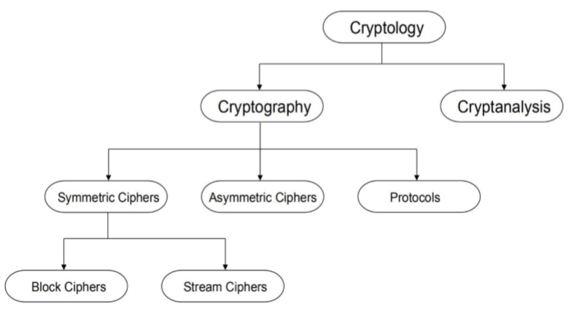

# 信息安全

> 本门课程类似于科普和入门性质的选修课，内容都是基本概念和思路，涉及的技术性内容不多，笔记同理。
>
> 大量LaTex公式警告

## 一、 简介

### 1.1 网络攻击

总之一句话：计算机网络不安全，需要进行安全保证。

防御系统：加密原语 -> 协议和政策 -> 实现 -> 终端使用

网络攻击的例子：

- 僵尸网络botnet：由僵尸主机控制的计算机网络，用来发送垃圾邮件、窃取信息、安装间谍软件、瘫痪网络DoS攻击等
- 蠕虫worm：可以自我复制并在网络中传播的程序

- 资料隐码攻击SQL injection：通过把SQL命令插入到Web表单递交或输入域名或页面请求的查询字符串，最终达到欺骗服务器执行恶意的SQL命令。

- 网络钓鱼phishing（phreaking+fishing）：通过发送声称来自于银行或其他知名机构的欺骗性垃圾邮件，意图引诱收信人给出敏感信息

- 网络恐怖主义Cyberwar, cyberterrorism：利用网络进行恐怖活动

### 1.2 信息安全

信息安全需要保障的"CIA"：

- 保密性confidentiality：防止与侦测信息的不当披露。信息只能被被授权的实体进行进行访问
- 完整性integrity：防止与检测对资料的不当修改，如伪造信息、添加病毒等

- 可用性availability：防止和检测不适当的拒绝服务。信息资源可被授权实体按要求访问、正常使用或在非正常情况下能恢复使用的特性。也就是出现意外与否时都能继续提供正常服务的保证。

总之是防止和检测任何不当行为。

不同场景下这几个方面可能协同也可能互斥。

此外还需要做到的有：

- 认证authentication：
  - 信息认证：保证信息真实
  - 实体身份验证：保证对等实体是真实的

- 不可否认性non-repudiation：保证信息的发送和接收方不能否认自己发送或接收了信息

安全攻击分为：

- 被动攻击：窃听或监视传输。接收方正常收到发送方的消息。
- 主动攻击：修改和创建虚假数据。接收方收到第三方操作过的消息。

### 1.3 安全管理总览

如何系统地保障安全性。安全不仅是加密，还涉及整个系统的管理。从硬件、软件到网络和人。需要一套安全规则和程序，能够进行访问控制、进行入侵检测，有一定的容错性（算法鲁棒性等）。

安全、功能强大、易于使用、开销之间存在权衡关系。

含糊的安全性：通过隐藏安全机制的内部运作原理来保证安全

相关术语：

- 弱点/漏洞Vulnerability ：系统的薄弱处，如bug
- 攻击attack：利用漏洞的行为
- 威胁threat：潜在的攻击
- 攻击向量attack vector：攻击的手段
- 攻击表面attack surface：系统中可能受攻击的地方。可以含或不含漏洞。

----------

## 二、对称密码系统

情景引入：Alice想给Bob发送消息，但信道不安全。需要通过不安全的媒介进行安全的交流。

### 2.1 密码学概念

密码学Cryptology包括：

- 加密cryptography：用数学方法加密信息，保证上一章提到的要求，将数据转化成看上去完全随机的样子。加密信息需要能够被还原。
- 解密cryptanalysis：破解加密系统

密码学和隐写steganography的区别：

- 前者关注内容，隐藏信息的意义
- 后者关注存在，隐藏信息的存在

密码系统相关概念：

- 明文plaintext：原本的信息
- 密文ciphertext：编码后的信息

- 密码Cipher：将明文加密为密文的算法
- 钥key：只有发送和接收方知道的、密码需要用到的信息
- 加密Encipher/encrypt
- 解密Decipher/decrypt

### 2.2 攻击模型

- 唯密文攻击ciphertext only：攻击者只知道密文，通过截获密文进行分析破解密码系统。任何能这样被破解的算法都是完全不安全的。
- 已知明文攻击known plaintext：攻击者知道**部分**明文以及对应的密文
- 选择明文攻击chosen plaintext：攻击者可以选择任意的明文进行加密，得到相应的密文，即知道加密算法。标准安全等级要求算法能够抵抗选择明文攻击。
- 选择密文攻击Chosen ciphertext ：攻击者可以选择任意密文进行解码来获得明文，即知道解密算法
- 选择文本攻击chosen text：选择明文+密文攻击

依据攻击模型，有：

- 完全安全的密码perfectly secure cipher要求：
  - 不论计算机多强大都不能破解密文
  - 密文不会揭露明文的任何信息，能够有效抵抗选择密文攻击
  - 明文不会揭露密文的任何信息，能有效抵抗已知和选择明文攻击

- 计算安全密码computationally secure cipher要求：
  - 破解密码的代价大于加密信息的价值
  - 破解密码的时间大于信息的有效生命周期

依据算法是否公开，分为：

- 算法保密：算法保密从而提升安全性
- 算法公开：安全性完全依赖于钥的安全性。公开有助于发现缺陷

Kerckhoffs法则：除了密钥外，系统所有的信息都公开，密码系统仍然要保证安全性

### 2.3 历史上的经典算法

- 第一代：经典密码，基于纸和墨
  - 替代密码Substitution cipher：替换文本内容
    - 单字母秘密mono-alphabetic：caesar凯撒算法
    - 多字母密码poly-alphabetic： Vigenere维吉尼亚算法
  - 置换密码Permutation cipher：交换文本顺序
- 第二代：使用加密引擎，机电化
- 第三代：现代密码学，基于高等数学和终端计算机系统，强调信息理论安全性和计算安全性

#### 2.3.1 凯撒密码Caesar cipher

将字母都往后移动k个。这里的k即为钥。

形式化语言：

- 明文P、密文C都属于26个字母
- 加密：$e_k(x)=(x+k)\%26，x\in P$
- 解密：$d_k(y)=(y-k)\%26,y\in C$

广义凯撒密码：26个字母到26个字母为双射。映射的关系无规则。有26！种可能性，约为2^88。故为了指定映射，需要88位的密钥。

针对其的攻击：

- 已知明文攻击很容易破解

- 唯密文攻击：通过频率统计破解

频率分析使得替换密码的方式都不安全。对此的改进：

- 使用数字作为密文字母，一些无意义的内容随机插入

- 故意拼错单词

- 多名码代替密码Homophonic substitution cipher ：一个字母映射到多个可能的字符

这些做法只能让频率分析更加难，但不能完全防止。单字母密码仍然容易受到频率分析的攻击。由此出现了多字母密码。如阿尔贝蒂密码盘，为同心环，明文在内环，密文在外环，外环字符更多。通过旋转内外圈形成不同的对应关系。

#### 2.3.2 维吉尼亚密码Vigenere Cipher

代替密码、多字母密码。本质是多个单字母密码。

如，密钥设置为(3,1,5)，则第一个字母后移3个，第二个后移1个，第三个后移5个，之后重复，以此类推。

形式化语言：

- 加密：$e_k(p1,...,p_m)=(p_1+k_1,...,p_m+k_m)\%26$

- 解密：$d_k(c1,...,c_m)=(c_1-k_1,...,c_m-k_m)\%26$

可以看做是多个凯撒密码的结合。频率分析更难了，但也不是不可能。可以找出密钥长度m，将密文差分成m个凯撒密文。找出m的方法可以全面搜索或进行Kasiski测试。

Kasiski测试：通过找密文相同部分的间隔来推断m。

频率统计使得替代密码都不安全，由此出现了置换密码。

#### 2.3.3 置换密码permutation

通过调换文本内的字符顺序来加密。

- 1D置换：如密钥(1,3,-2,0,-2)，则五个一组字符的**位置**分别+1、+3、-2、不变、-2
- 2D置换：将字符按顺序排列放在m*n的矩阵内，加密后一列一列地读取。先读哪一列后读哪一列由密钥决定，如(4,3,1,2)则先第三列再第四列再第二列，最后第一列

置换密码的例子： 密码棒Scytale，将写在纸条上的明文环绕在棒子上，密文是依次从棒子的一头读取到另一头得到的

#### 2.3.4 电机密码或机器密码

谜Enigma（又译Enigma引擎）：使用转轮密码机，有多个旋转轮，每个实现了一个多字母替代密码，每个转子的输出被送入下一个转子。二战时德国广泛使用。

单转子Single cylinder不断旋转，字符在文本中的不同位置使得转子转到了不同位置。每个位置对应一个字母。多转子中每个转子的输出是下一个的输入。对于n转子来说，可能性有26^n种。一开始的明文在输入转子前要进行置换密码加密。初始转子需要保密。

#### 2.3.5 现代密码

基于高等数学和终端计算机系统。分为：

- 对称密码学：单个私钥用于加密解密
- 不对称密码学：公钥和私钥分别用于加密解密。

基于哈希算法：明文经钥加密形成密文，密文经钥解密变回明文。

### 2.4 对称密钥加密系统

只有单个密钥。是交叉替换和排列密码的多重应用。能够快速加密解密，但密钥交换是个问题。常用于保密服务。

- 流密码stream ciphers：一次加密一个单位（如：一位）的明文
- 块密码block cipher：将明文分成多块，以块作为基本单元进行处理

#### 2.4.1 一次一密one-time-pad

OTP是一种流密码。明文M、密钥K、密文C的长度相同。加密：C=M异或K，解密：M=C异或K

- 优点：如果K完全随机且是一次性的，则该算法有效，C中不含任何与M有关的消息
- 缺点：K的随机生成和传递

OTP是迄今为止唯一被证实安全的协议。  如果说一个系统能够完美保密，对于任意的m和c都要有：
$$
Pr(M=m) = Pr(M=m|C=c)
$$

#### 2.4.2 数据加密标准DES

块大小：64位；密钥大小：56位。最流行的分块密码之一，研究得多的对称算法。由于密钥长度，现在被认为是不安全的。3DES领域产生了非常安全的密码，至今仍被广泛使用。2000年代被高级加密标准AES取代。

设计标准：

- 高安全性
- 安全性必须存在于密钥中，而不是算法中
- 没有申请专利
- 高效的硬件实现
- 低效的软件执行

#### 2.4.3 Confusion&Diffusion

有两种原语可以用来构建强加密算法:混淆confusion和扩散diffusion

Confusion ：

- 使(明文，密钥)和密文输出之间的关系尽可能复杂(非线性)

- 通过替换substitution实现

Diffusion：

- 将每个输入位的影响扩展到多个输出位
- 通过排列permutation实现

需要将上述二者组合进行加密。从而有了乘积密码product ciphers。绝大多数今天的块密码都是乘积密码。改变明文的一位平均使得密文的一半都会改变。由轮rounds组成。每一轮包含一个替换和一个排列。

#### 2.4.4 DES算法总览

块大小：64位，密钥大小：56位，对称密钥，16轮，每一轮有不同的子密钥，由主密钥得到。

##### IP表和IP^-1表

DES算法有两个表，表示初始排列变换initial permutation和最终排列变换final permutation，分别记为IP和IP^-1。这些排列变换都是对位进行操作，两个表都为8*8的，共64位，对应64位明文的每一位。其中，IP^-1是IP的逆变换。IP表和IP^-1表的使用方法相同，以IP表为例：假如第一个数据为58，则有：原来明文的第58位作为新的密文的第1位，之后的数据依次类推进行排列变换。最终的IP^-1表进行还原，表中第50个数为1，表示将第一位的数字移到第50位。从硬件角度考虑，IP表不会产生安全值。

##### 子密钥的生成

同样也有`PC-1`表对一开始的密钥k进行换位操作。`PC-1`表为8*7大小。密钥共64位，但是第8、16、24...位不会用到，所以之前才说密钥为7\*8=56位。密码能够均分为左右两个部分。对每一轮来说，密钥都要经过两个变换：首先左半部分和右半部分各自进行左移。其中最高位会移动到最低位。在第1、2、9、16轮左移一位，其他轮左移两位。接着用`PC-2`表进行排列变换。注意每一轮用的都是一个`PC-2`表。`PC-2`表只有8\*6，故子密钥只有48位。这些密钥分别记为$k_1,k_2,...k_n$

##### Feistel网络

是用于块密码加密解密的重要模板。加密解密只是箭头方向不同而已。

将明文拆成左右两块，分别记为$L_i$和$R_i$。在每一轮中，有：
$$
L_i=R_{i-1}，R_i=L_{i-1}\oplus f(R_{i-1},k_i)
$$
在16轮后，最后再交换L和R，在进行上述的IP^-1操作，最终得到了密文$y=DES_k(x)$

##### 加扰函数Scrambling function `f`

函数`f`对每个$R_i$进行变换，共有四步：

1. 拓展E：通过8*6的表E将32为的$R_i$拓展到48位。有的位是重复的
2. 和本轮密钥进行异或操作：$R_i$和本轮的密钥都是48位，正好用来异或

3. S-box替换：共8个替换表，每个表用6位输入产生4位输出，非线性且能抵抗微分密码分析，是DES算法安全性的关键，唯一的非线性部分。前面6位查第一个表，接着六位查第二个表，依次类推。具体替换方法：取6位中的第1和第6位组成的两位二进制数作为行号，中间2、3、4、5位组成的四位二进制数作为列号去查表，查到的4位数替换原来的6位数。输出32位。

4. 排列P：使用4*8的P表进行排列转换。

这样，在5轮后，密文每一位都已经收到了明文中每一位和密钥中每一位的影响。

##### 解密

解密和加密的步骤完全相同，但是使用的子密钥的顺序要从$k_1、k_2...k_{16}$换为$k_{16}、k_{15}...k_1$。

##### 总结

涉及的操作：排列permutation、交换swap、替换substitution（s-box）、位丢弃和位重复、循环位移、异或。硬件实现简单但软件实现困难。

DES有强大的雪崩效应，明文或密钥1位的改变都可以造成密文的剧变。

#### 2.4.5 DES弱点与改进

DES有两个缺点：56位的密钥空间太小、s-box设计标准的保密（后门？）。到目前为止，在现实场景中还没有已知的分析性攻击。

2DES，即对明文进行DES操作两次，可以使得密钥空间增加为56*2=112位，但这不会提高破解的复杂度。

3DES，使用三个密钥$K_1、K_2、K_3$相同。其中$K_1=K_2$或者$K_1=K3$。若是前者，则前两次加密效果抵消，相当于做了一次DES。若是后者，则相当于用了两个密钥进行3次DES加密。

当密钥的左半和右半部分全0或全1时，这2*2=4种情况称作弱密钥weak keys。容易暴力破解、16个子密钥互不相同、明文加密两次后仍然是明文。除了全1或全0，还有0和1交替、1和0交替的情况，这4\*4-4=12种情况（减去的为弱密钥的4种）被称为半弱密钥semi-weak keys。两个弱密钥依次加密明文后得到的还是明文。

#### 2.4.6 AES

DWS的密钥太小，而3DES太慢，从而有了AES。AES特征：对称块密码、128位块大小，128/192/256位密钥大小、比3DES更强更快、提供了完整的设计细节、C和java都有实现版本。

目前对AES没有已知的成功攻击案例。对于蛮力攻击，AES-128比DES困难得多。

-----

## 三、 非对称密码系统

对称密码系统的密钥交换困难，且身份验证和不可抵赖性难以保证。非对称密码系统使用公钥和私钥进行加密解密，公钥是公开的，私钥是自己保留的。非对称密码往往更难通过计算破解，对称密码系统从而过时了。

活板门单向函数trapdoor one-way function：

- $Y=f_k(X)$，已知k和X时容易计算
- $X=f^{-1}_k(Y)$，已知k和Y时容易计算
- $X=f_k^{-1}(Y)$，已知Y但不知道k时难以计算

设计非对称密码算法就是要找到一个活板门单向函数。

### 3.1 RSA算法

公钥方法中最广泛使用的方法，利用了因式分解的困难性。钥的大小可变，一般是1024位或更大。

#### 3.1.1 数学基础

模运算：求余。

- a+b mod n = a mod n + b mod n

- a*b mod n = (a mod n) * (b mod n)

欧几里得算法：辗转相除；拓展欧几里得算法：ax+by=gcd(a,b)

逆元：若gcd(a,n)=1则存在x使得ax = 1 mod n

解同余方程，如：5x = -4 mod 11。由欧几里得算法有：gcd(5,11)=1，-2\*5+1\*11=1，故-2 = 1/5 mod 11

原式5x = -4 mod 11，两边同乘-2有：-10x = 8 mod 11，将x化出11的倍数并约掉：-11x+x = 8 mod 11，有x = 8 mod 11。

如果要解5x = -4 mod 10无解，因为gcd(5,10) = 5 != 1

费马小定理：对质数p有$a^{p-1} \mod p =1$

欧拉函数：$\phi(n)$表示[1,n]的整数中与n互质的个数。若p为质数则$\phi(p)=p-1$。$\phi(pq)=(p-1)(q-1)$

欧拉定理：如果gcd(a,n)=1，则有$a^{\phi(n)}=1\mod n$。

费马小定理的推广：对任意质数p和q，有a  = 1 mod (p-1)(q-1)，则有：$x^a = x\mod pq$，对任意的x<pq成立

#### 3.1.2 RSA算法流程

可以参考[算法设计的笔记]([https://github.com/ender507/Lesson-Notes/blob/master/%E7%AE%97%E6%B3%95%E8%AE%BE%E8%AE%A1.md#14-%E5%AF%86%E7%A0%81%E5%AD%A6%E9%97%AE%E9%A2%98](https://github.com/ender507/Lesson-Notes/blob/master/算法设计.md#14-密码学问题))。

M：明文，C：密文。

1. 找到很大的质数p和q
2. 令n=p*q

3. 选择和(p-1)*(q-1)互质的数e
4. 找到d使得e*d = 1 mod (p-1)(q-1)

加密：$C=M^e\mod n$

解密：$M'=C^d\mod n=(M^e)^d \mod n=M^{ed}\mod n=M$

其中，公钥为e和n，密钥为d。

#### 3.1.3 RSA的安全性

如果能从n得到p和q，则能够算出密钥。但是大数n的因式分解非常困难。目前，密钥大小为1024位被认为是安全的。

使得n难以因式分解的方法：

- p和q的长度相近但大小不要太相近。

- p-1和q-1都要包含较大的质数因子
- p-1和q-1的最大公因子要小
- d要比n^1/4大

#### 3.1.4 RSA的实现

如何随机取得两个质数？考虑随机生成数后进行质数检验。许多实现用的都是Rabin-Miller检验。还可以用费马小定理检验。存在卡迈尔数：完全能通过费马小定理测试的合数

选择e：e经常选择3或2^16+1=65537。二进制为11和10000000000000001。为了加速加密过程，数字为1的位数越少越好。

 平方乘积算法（快速幂）Square-and-Multiply：直接计算$x^e\mod n$可能会相当低效。使用快速幂加速运算。

d的计算：欧几里得拓展算法解同余方程

#### 3.1.5 对RSA的攻击

- 消息猜测message guessing：如果明文状态有限，攻击者可以猜明文并且用公钥测试猜测的明文。为了避免此类攻击，可以在明文中接入随机数字

- 时序攻击timing attack：在进行平方乘积运算时，如果某位为0则算得快，某位为1则算的慢，依据时序快慢来判断密钥中的0和1的分布

#### 3.1.6 RSA应用

混合系统hybrid system：同时使用对称和非对称密码系统：每次发送信息生成随机的会话密钥，用公钥算法来发送会话密钥，使用对称算法使用会话密钥加密数据。

混合加密mixed encryption：有效地将加密消息发送到多个目的地。使用密钥K加密M，再用接收方的公钥加密K

密钥协商secret key negotiation：A和B各自向对方用公钥算法发送$R_1$和$R_2$，去$K=H(R_1||R_2)$作为共享的密钥。

### 3.2 块密码block ciphers的特征

具有块大小、钥大小、轮rounds数、操作模式operation mode：多大的消息被加密，以及安全的重要性

美国国家标准与技术研究院NIST定义了五种操作模式：

- 电子码模式electronic codebook mode，ECB：明文被分成多块，每一块单独进行加密解密，每块之间相互独立。简单但不安全，明文中的重复内容会在密文中有所体现。

- 密码块链模式cipher block chaining mode，CBC：现在使用最多。之后的块的机密收到之前的块的影响，从而使得明文的重复部分产生不一样的结果（每一块的密文异或下一块的明文上再对明文进行处理）。但加密不能并行，且一个块的信息错误会导致之后大量的错误
- 密码反馈模式cipher feedback mode，CFB：引入了下面IV的概念。IV被密钥进行加密后重复：和明文块相异或生成密文、结果被密钥加密后异或上第二块明文形成第二块密文，以此类推。类似于OTP的效果。
- 输出反馈模式output feedback mode，OFB：和CFB类似，但每次进行加密的不是IV和明文块的异或，每次只有IV被反复加密，每次的密文是加密后的IV和明文的异或。可以进行预处理且错误传递可以被限制。不同的消息用于不同的IV。
- 计数器模式counter mode，CTR：生成一个值nonce（number once，只用于一次消息发送的随机值），nonce依次拼接（字符串加）1、2、3...对应不同的块。得到的和被密钥加密，与明文快相异或形成密文块。

初始向量initialization vector，IV：和密钥一起使用。对于给定的明文，密钥或IV改变，密文也会改变。IV随机生成，可以和密文一起发送。IV递增且能被接受者预测。

| mode | description                                                  | typical application                          |
| ---- | ------------------------------------------------------------ | -------------------------------------------- |
| ECB  | 每个块的明文独立被相同的密钥加密                             | 单个数值的安全传输，如密钥                   |
| CBC  | 加密算法的输入为上一块的密文和本块明文的异或                 | 通用面向块的传输。有认证                     |
| CFB  | IV加密并与明文块异或生成密文，密文作为下一块的IV             | 通用面向流的传输。有认证                     |
| OFB  | IV加密IV加密并与明文块异或生成密文，加密后的IV作为下一块的IV | 面向流的、通过噪声大的通道的传输，如卫星交流 |
| CTR  | 明文与加密后的计数器异或形成密文                             | 统用面向块的传输，高速应用中很有用           |

### 3.3 Diffie-Hellman 协议（DH协议）

#### 3.3.1 DH算法

仅使用公共通信协商密钥，不提供身份验证。公共信息参数：

- p：大质数，一般为512位
- g：模p的一个原根。模p的原根是一个有限集，满足：对任意和p互质的a，存在z使得：$a=g^z\mod p$。

如：2是5的原根，因为对于与5互质的2、3、4，有：
$$
2^0 = 1 \mod 5
$$

$$
2^1 = 2 \mod 5
$$

$$
2^3=3\mod 5
$$

$$
2^2=4\mod 5
$$

1. Alice选取一个随机数a，Bob选取b
2. Alice计算$A=g^a=\mod p$，同样对Bob有$B=g^b\mod p$
3. Alice和Bob交换A和B

4. Alice计算$B^a=g^{ab}\mod p$，Bob也有$A^b=g^{ab}\mod p$，二人把$g^{ab}\mod p$作为私钥。

不可能从A和B推导出k：离散对数问题

#### 3.3.2 DH攻击

DH中间人攻击：第三人伪装双方的通信方。DH不能进行用户认证。

DH电话本模式phone-book mode： Alice和Bob公布自己的A和B，来避免中间人的混淆。需要发布值的可靠性。

#### 3.3.3 分组DH

Alice、Bob、Carole三人想要通信。可以使用基于DH的协议。

### 3.4 哈希函数Hash function

任意长度输入到固定长度输出。也被称为：消息摘要message digest、单向转换one-way transformation、单向函数one-way function、哈希hash

输出长度远小于输入，常常是定长，128位或160位。

#### 3.4.1 期望的性质

- 高性能：从输入m能很容易算出结果H(m)

- 单向one-way：对给定的H(m)，不能通过单纯的计算回推得到m
- 弱耐碰撞weak collision resistance：已知H(m)，不能通过计算去得到m'使得H(m')=H(m)

- 强耐碰撞strong collision resistance：不能通过计算得到m1和m2使得H(m1)=H(m2)

将哈希函数的输入称为原像pre-image，结果称为映象image。

为什么映象是128位或160位？位数多增加不必要开销，少则产生碰撞。对k个消息，哈希函数映象的最小长度需要保证两条消息有相同哈希输出的概率小于0.5。

生日悖论：k个人中，至少两人同一天生日的概率大于0.5，n=365天，问最小人数k。
$$
p(k人中都不同一天生日)=\frac{n(n-1)...(n-k+1)}{n^k}
$$

$$
p(至少2人同一天生日)=1-p(k人中都不同一天生日)>0.5
$$

解得：k>22.54。

同理放到哈希来，k个消息一共有n=2^m种可能的映象，m为映象的位数。为了使得碰撞概率大于0.5，则k>2^(m/2)。

#### 3.4.2 哈希的应用

加密保护机密性，但不保护完整性。常用于身份验证和数字签名。

- 文件身份验证：目的为侦测文件修改：存储一份f，看用户的f'是否满足H(f)=H(f')。

- 用户身份验证：Alice和Bob共有密钥k，Alice想向Bob验证自己的身份。则A发出请求让B发来随机数R，A发回H(R|k)。

- 消息身份验证：Alice想向Bob验证消息，则向Bob发送消息M、随机数R、H(M|k|R)。

有时哈希还能直接用于信息加密。如OTP和CFB。

Merckle树：每个分支节点由哈希函数进行计算的二叉树

数字签名：不需要加密整个消息。可以确保:完整性，身份验证，不可否认性

#### 3.4.3 承诺协议Commitment Protocol

场景引入：A和B各自选择一个数字X，Y，然后同时交换数字。若两个数字之和为奇数则A胜利，否则B胜利。为了避免先得到对方数字再自己选择的情况，需要在双方发生前确定已经各自选好了数字。

协议：A向B发H(X)表示确认，B再发Y，A再发X。B可以验证H(X)，但不能从H(X)得出X。

### 3.5 公钥基础设施PKI

A为了取得B的公钥需要和B交流，此时容易被中间人混淆。因此出现了PKI。

证书是一种经过签名的消息，证明特定名称与公钥相匹配。证书由受信任的第三方签署。证书包括ID（name和address）、公钥、截止日期、证书签名

一个受信任的第三方T签署了B的证书，则如果A有T的公钥，则直接向T请求B的公钥。

PKI包括：

- 证书颁发机构Certificate authority，CA：为所有节点维护公钥的可信实体。每个节点保留自己的私钥。CA为每个新参与者颁发物理证书。CA可以是公共的也可以是私有的，多个CA组成信任链trust chain。

- 证书Certificates
- 登记部门Registration Authorities，RA：CA可以将新参与者的注册委托给RA。RA没有CA的密钥，不能进行整数签名。RA仅物理上验证新参与者。RAs检查身份并向CA提供相关信息(身份和公钥)以生成证书。
- 用于检索证书的存储库
- 撤销/更新证书的方法

证书撤销Certificate Revocation： CA维护一个证书撤销列表CRL，CA定期发布的CRL，包含已撤销的证书，并根据CRL检查每个事务。

在网络上使用PKI，因为PKI为集中式分层的模型，没有全世界能共有的CA。解决方法：信任朋友的朋友。由直接信任变为层次信任，从而形成信任网。

-------------

## 四、 安全认证

- 识别identification：判断用户是谁
- 认证authentication：证明用户身份
- 授权authorization：决定用户行为

### 4.1 基于密码的认证

#### 4.1.1 固定密码fixed password

最常用的认证方式，需要容易记，难以猜。在文件中存储密码明文存在风险，考虑将密码进行哈希处理的结果进行存储。

针对密码的攻击：

- 智能搜索
- 基于统计尝试最常用的密码（123456等）
- 字典攻击

  - 线上：创建常用密码的字典，依次套用来尝试密码
- 线下：获得密码文件，与字典比较，从而破解哈希
- 窃听
- 后门
- 钓鱼

密码加盐法：存储密码时加上干扰内容（称为盐salt），经哈希处理。需要的存储内容为：用户名+盐的内容+加盐密码经过哈希后的结果。用户名用于获取盐从而能够从加盐密码中去盐。

#### 4.1.2 一次性密码one-time password

若通信双方a和b都有哈希函数h，而a有生成的密码w。假设需要三次认证

1. 初始化：a计算$w_0=h^3(w)$并将$w_0$通过安全信道发给b，b保存结果。3次方表示经过3次哈希而不是数学的三次方。
2. 第一次认证：a计算并发送$w_1=h^2(w)$以及认证次数，b检查认证次数和$w_0=h(w_1)$
3. 第二次认证：a计算并发送$w_2=h^2(w)$以及认证次数，b检查认证次数和$w_1=h(w_2)$
4. 第三次认证：a计算并发送$w_3=w$以及认证次数，b检查认证次数和$w_2=h(w_3)$

### 4.2 密码认证协议：质询challenge-响应response

目标：相互认证，通信双方都要相互验证。通过创建会话密码实现。

考虑非对称密码系统，有私钥$PR_A$和公钥$PU_A$，以及一次性的随机数nounce，记为n。理想的n需要：不可预测和新鲜（整个协议执行时只会使用一次）。实践中nounce是随机大数，为了新鲜会加入序列号或时间戳。发消息时也需要发送n和$\{n\}_{PR_A}$。

#### 4.2.1 非对称密钥

- 发送方发送身份A、随机数n、加密随机数$\{n\}_{PR_A}$。攻击者可以发相同的含加密前后的n的消息冒充发送方。将$\{n\}_{PR_A}$换为$\{n\}_{PU_A}$不可行，所有人都知道公钥从而能加密n。
- 先发消息A，接收方发回n，发送方再发$\{n\}_{PR_A}$。这样攻击者就不能通过重发$\{n\}_{PR_A}$来冒充。二者之间能够有身份验证，但是没有会话密钥建立。
- 先发消息A，接收方发回n，发送方再发$\{n,K_{ab}\}_{PR_A}$，其中$K_{ab}$为会话密钥。但是攻击者可以通过发送方的公钥来获取$K_{ab}$。
- 回发的再改为$\{\{n,K_{ab}\}_{PR_A}\}_{PU_B}$。容易受到中间人攻击：攻击者创建独立的连接并在他们中间封装消息。中间人作为C与A通信，通过A的消息伪装成A与B通信。
- 发回的改为$\{\{n,K_{ab}\}_{PU_B}\}_{PR_A}$。只有A和B知道会话密钥$K_{ab}$。然而B认证了A，A却不能认证B
- 第四步，B再发回$\{m\}_{PR_B}$。可能遭到中间人攻击
- 第四步发回的改为$\{m\}_{K_{ab}}$。

#### 4.2.2 对称密钥

- A发送$A,n,\{n\}_{K_{AB}}$。可能遭到重复消息的攻击
- 发消息A、返回n、再发$\{n\}_{K_{AB}}$。没有会话密钥、相互验证。需要加入会话密钥$k_{ab}$，在A方也加入随机数m
- 发消息A、返回n、再发$\{n,k_{ab}\}_{k_{AB}},m$、再返回$\{m\}_{k_{ab}}$。在群体通信时，每队用户都要有各自共享的密钥。群组加入新用户时每个人都要生成新的密钥。
- 考虑选择可以信任的第三方。先发送A、返回n、再发$\{n\}_{K_A}$，接收方再向第三方认证中心发送$A,\{n\}_{K_A}$，认证中心返回$\{n\}_{K_B}$。不能防止中间人攻击
- A最后发送$\{n,B\}_{K_A}$，B向认证中心发送$A,\{n,B\}_{K_A}$。仍然不安全：攻击者同时冒充发送方和认证中心
- 认证中心返回$\{n,A\}_{K_B}$。信息对称性使得该协议不安全。
- 认证中心返回$\{n,A,k_{ab}\}_{K_B},\{B,k_{ab}\}_{K_A}$，再由B给A发$\{B,k_{ab}\}_{K_A}$。还缺少相互认证
- A最后还要发m，B最终还要返回$\{m\}_{ab}$。

#### 4.2.3 Needham-Schroeder协议

基于信任的第三方T，拥有密钥$K_A、K_B$以及三方通信的密钥，使用会话密钥$K_S$。

1. A向T发送与B会话的会话请求码$k_A$
2. T返回$\{k_s\}k_a,\{k_s\}k_B$
3. A向B发送$\{k_s\}k_B$
4. 二者通过$\{m\}{k_s}$进行通信

容易遭到重复信息攻击。考虑加入随机数r：

1. A向T发送$\{A,B,r_1\}$
2. T返回$\{A,B,r_1,k_s,\{A,k_s\}k_B\}k_A$
3. A发给B$\{A,k_s\}k_B$
4. B返回$\{r_2\}k_s$
5. A返回$\{r_2-1\}k_s$

如果攻击者从旧消息获得了会话密钥则可以重复3~5步进行攻击。考虑在第二步的$\{\}k_B$内加入时间戳T，3中也加入时间戳。

#### 4.2.4 Kerberos认证

包含：

- 应用客户端Client：向服务器发送服务请求的客户端
- 认证服务器AS：用于认证客户端
- 票据授予服务TGS：授予访问服务器的票据
- 服务服务器SS：拥有客户端的服务请求

具体步骤：

1. 用户登入：使用ID和密码登入。客户端用哈希映射密码到$H(pwd)$
2. 用户认证：客户端将上述内容发给AS，AS返回消息，消息分为两部分：由哈希后的密码生成的会话密钥和客户端无法解密的票据TGT。
3. 访问授权：客户端将TGT和ID、时间戳发给TGS，TGS返回客户端-服务器票据和客户端-服务器密钥
4. 客户端发送客户端-服务器票据、用户ID、时间戳给SS，SS发送带时间戳的消息

### 4.3 关于随机数

`srand(time(NULL))`是高度可预测的。一年内的秒数很少，输出也不是很随机，只需要关心最后几位。

真随机：

- TRNG真随机数生成器
- 按均匀分布单独生成每一位
- 所有输出的可能等价，不相关、无特征

伪随机：

- CS-PRNG密码安全伪随机数发生器
- 选取随机的、短期有效的种子
- 生成很长的序列，计算上无法与真实随机位区分

秘密分享：信任实体TA将密钥K拆分成多个S1~Sn，分别分给U1~Un。可以从n个共享中的任意t个重建K，但t-1不行。这称为(n,t)阈值密码threshold secret共享方案。

零知识证明ZKP：证明自己知道某消息却不透露该消息

此外还有生物测定biometrics的认证方法

---------------

## 五、访问控制

 让有权限的用户做授权的事情，包括使用硬件、OS、网络服务、数据库等服务等。

主语subject：激活需要的实体来访问资源

宾语object：被主语访问的被动实体

访问控制：定于主语可以对宾语执行的操作

引用监视器reference monitor：决定过滤访问命令的过程，在主语访问宾语时进行控制保护：

subject -> action -> reference monitor -> object

最小特权原则：每个主语只能访问完成工作必须的资源，不能访问过多的资源。

### 5.1 自由支配Discretionary访问控制DAC

资源拥有者决定访问权限，特别是基于身份的访问控制，拥有者需要特定所有其他用户的权限。任何主语可以给其他主语发送消息。某些情况下，访问权限可以被转移。用户由访问许可负责。

最常用的访问控制方法，如Unix文件系统就使用该方式。

违反最小特权原则。访问许可的转移可能不会通知拥有者。DAC对守规矩的用户可以很好地限制访问，但不适用于敏感的系统。

### 5.2 强制Mandatory访问控制MAC

动机：在敏感环境中也能保证控制消息流的正常运作

非自由支配：每个主语的许可是固定的

访问授权有特定规则，又称为基于规则的访问控制

管理员对访问许可负责

### 5.3 基于角色的访问控制RBAC

由角色决定访问：

- 管理员依据不同的工作定义不同的角色
- 每个角色获得执行相关操作的许可
- 用户被授予一个或多个角色

可以由MAC和DAC进一步强化

访问控制矩阵：计算机保护内容的抽象，行为域，即主语或主语组，列为宾语。矩阵中每个实体表示主语对宾语的权限。如：

|       | bill.doc    | edit.exe | fun.com          |
| ----- | ----------- | -------- | ---------------- |
| Alice | $\empty$    | exe      | exe, read        |
| Bob   | read, write | exe      | exe, read, write |

### 5.4 Bell Lapadula(BLP)模型

多级强制访问控制：实体被赋予了安全等级：

- 军事领域：高级机密TS > 机密S > 保密内容C > 未分类NC
- 金融领域：限制级R > 权限级Prop > 敏感Sens > 公开Pub

实体分类、需要知道基本原则、职能分开

安全标签：例如将US、EU对TS有权限记为：$(TS,\{US,EU\})$。关系间的子集关系被称为dom支配（dominate）。$(n1,C1)$支配$(n2,C2)$当且仅当$n1$的安全等级高于$n2$且$C2\subseteq C1$。由安全标签可以生成一系列点阵。

用LS(S)和LS(O)分别表示主语和宾语的安全标签，则有：

- 基本安全条件：S可以读O当且仅当LS(S)支配LS(O)
- 所有权：S可以写O当且仅当LS(O)支配LS(S)

-------

## 六、 缓冲溢出

溢出导致：

- 相邻的内存被覆盖：如数组超出索引
- 程序数据被修改：相邻内存正好为数据
- 代码被注入：相邻内存为指针，通过修改指针改变了代码执行序列

常见的溢出问题：

- 栈粉碎stack smashing调用函数时，数据溢出导致调用栈被破坏，导致返回时进入溢出部分数据特定的地址位置。会遭到恶意代码注入攻击
- 格式化字符串漏洞：如果直接将字符串作为`printf`等函数的输入，通过`%x`等字符可以读出内存信息
- 整数转换漏洞：如提供小于0的值作为`memcpy`的长度参数，将会复制一大段内存，或者单纯的数据类型导致的溢出

防御和对策：

- 使用更安全的语言（Java、C#、Python等而不是C/C++），不用老旧的代码。实践上不可行
- 安全地编程，避免程序结构导致的风险
- 将栈标记为不执行，不阻止更一般的溢出如堆溢出，且一些应用，如LISP解释器，必须要用栈
- 运行时检查内存安全
- 运行时溢出检测：如StackGuard技术，在栈中插入“金丝雀canaries”，执行代码时检测其完整性
- 攻击抑制：随机化技术，通过随机避免攻击者对内存位置与内容的了解

---------

## 七、 网络安全

网络特征：

- 异构网络的互联
- 不可靠的通信
- 分层架构

### 7.1 针对网络的攻击

#### 7.1.1 数据链路层

##### 针对网桥的攻击

网桥会记录MAC地址与来源端口，称为转发数据库。针对其的攻击：利用转发数据库的大小限制，发送虚假的帧与随机源MAC地址。表充满时,合法的消息将广播给所有链接，主机在任何端口现在可以看到所有消息。这样一来，攻击使得网桥变成了集线器。

##### 针对VLAN的跳Hop的攻击

虚拟局域网VLAN下，可以针对交换机攻击，攻击者伪装成有主干道的交换机，从而成为虚拟局域网的一员。这样一来就能看到所有VLAN中的信息。

对策：

- 禁用无用端口
- 禁用自动主干道的设置

- 自己设置主干道的设置

##### ARP表欺骗

[ARP协议机制笔记](https://github.com/ender507/Lesson-Notes/blob/master/计算机网络.md#arp协议)

地址解析协议ARP，给IP地址返回MAC地址，基于装着ARP请求的ARP表。

ARP表毒化：攻击者用自己的MAC地址来发送ARP请求

对策：

- 自动设置ARP项
- 无视与查询没有关联的应答

##### DHCP服务器欺骗

[DHCP协议机制笔记](https://github.com/ender507/Lesson-Notes/blob/master/计算机网络.md#dhcp协议使用udp协议)

动态主机配置协议DHCP会广播discover包，由服务器发回一个response包，包括IP地址、子网掩码、网关、DNS服务器、持续时间等。

攻击：假装自己是DHCP服务器进行回复

对策：

- 交换机端口可以配置为可信或者不可信
- 只允许特定机器发送DHCP反应
- 使用DHCP来跟踪客户行为数据

#### 7.1.2 网络层

因为没有地址认证，所以攻击者可以进行源地址欺骗。

针对路由器的攻击：

- 拒绝服务Denial of service(DOS)：淹没路由器

- 路由表毒化：发送错误的路由更新创建假的路线

边界网关协议劫持

#### 7.1.3 传输层

[TCP协议机制笔记](https://github.com/ender507/Lesson-Notes/blob/master/计算机网络.md#tcp)

TCP传输控制协议，“三次握手”，随机序列号`seq=K`与确认帧`ack=K+1`。

- TCP SYN淹没：发送大量SYN包，但是不完成任何握手，不接受连接，当接收到SYN段时不分配缓冲区和状态

#### 7.1.4 应用层

域名系统DNS：将域名映射到IP地址

DNS欺骗、DNS淹没、DNS重绑定

### 7.2 SSL/TLS协议

安全套接字层 / 传输层安全协议Secure Sockets Layer and Transport Layer Security protocols，二者有着相同的协议设计但有着不同的加密算法。

在攻击者面前的端到端安全通信：

- 攻击者完全拥有网络:控制WIFI, DNS, 路由器等
- 可以监听、修改、注入任何包
- 互联网安全的约定俗成的标准，部署在每个网络浏览器、VoIP（基于IP的语音传输）、支付系统、分布式系统等

目标：提供传输层安全协议。设置后对应用程序透明，感觉只是直接使用TCP套接字：

- Web会话应该是安全的

- 通过加密，防篡改和抵御中间人攻击

- 相互的身份验证通常是不需要的

- 客户端需要识别服务器，但服务器不会知道客户端。安全信道设置后依靠密码认证。

#### 7.2.1 TLS

目标：提供身份验证（一般是单向的）、隐私保护、数据完整性

- 数据加密：使用对称密钥加密数据。会话的开始生成密钥。

- 数据完整性：消息包含MAC与传输数据从而确保完整性
- 身份验证：使用公钥加密和证书身份验证

#### 7.2.2 SSL

SSL包含两个协议：

- 握手协议：使用公钥加密在客户端和服务器之间建立密钥
  1. 客户端明文发送消息，包括协议版本、支持的加密算法、随机数
  2. 服务器明文返回消息，包括二者支持的协议最高版本、最强的双方支持的加密算法、随机数、公钥证书（包含RSA或者Diffie-Hellman公钥）
  3. 以RSA为例，客户端生成随机密钥并且用RSA公钥加密
- 记录协议：使用密钥进行数据交换

握手协议的攻击：篡改明文消息，将协议版本改为低版本安全性差的。

 ### 7.3 有线等效保密WEP安全

WiFi：通过无线介质进行广播。