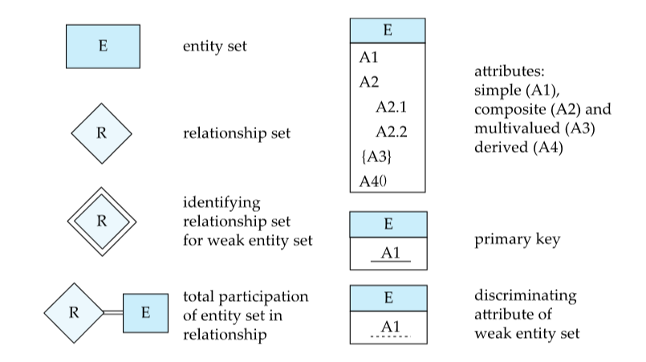
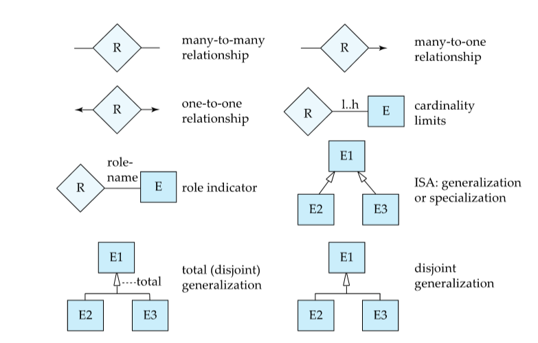
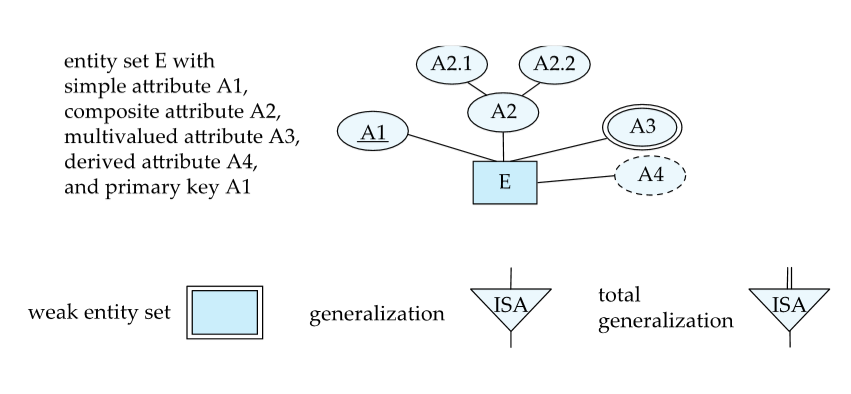
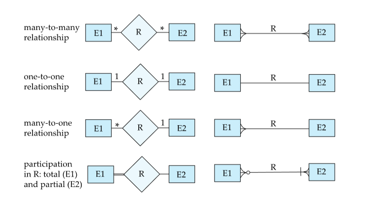

# 数据库系统原理

标题前打星号`*`表示水课

数据库课程涉及方面细节多，算法过程实现繁琐，笔记质量很低。

[TOC]

## 1. 介绍

在程序设计中认为，程序=指令+数据，而在本门课认为，程序本身就是数据。“数据”更加近似于“信息”，意义更为丰富。（但此处“数据”没有“大数据”抽象）

DBMS（数据库管理系统Database Management System）包含：

- 相关数据的集合（数据库）。数据有以下特点：
  - 高度有价值(原文valuable)
  - 数据量相当大
  - 被多个用户和应用访问，这经常是同时发生的
- 访问数据的程序集（管理）
- 方便有效的环境

### 1.1 数据库系统的应用

- 企业信息
  - 销售方面：客户、产品、采购
  - 会计方面：支付、收据、资产
  - 人力资源：员工、工资、税务
- 制造业：生产、库存、订单、供应链管理
- 银行与金融：
  - 客户信息、账户、贷款、交易信息
  - 信用卡交易
  - 金融：销售和购买金融品（股票、债券等）、储存市场实时数据
- 大学成绩、航班信息、电信、网络服务、文档数据库、导航系统... ...

### 1.2 数据库系统的目标

早期的数据库应用直接建立在文件系统上，造成了一下问题。解决这些问题是数据库系统的目标。

- 数据冗余与一致性问题：数据以多种格式进行存储
- 难以访问数据：每次要执行一个新的任务必须要写一个新的程序
- 数据隔离
- 完整性问题：完整性约束（如余额必须大于等于0）不能明确地声明，很难添加或改变约束
- 原子性的更新：更新中途失败会导致数据不一致（如转账时一个扣费一个加费）
- 多用户并发访问：性能、一致性问题
- 安全问题：只为用户提供部分数据的访问

### 1.3 数据Data的总览

数据模型：用于描述数据、数据关系、数据语义和一致性约束的概念工具的集合。

数据抽象：隐藏了复杂的数据结构，通过不同层次的数据抽象来代表数据库中的数据

数据库系统架构分为三个层次，从底层到上层依次为：物理层、逻辑层、识图层。有实例Instances和模式schemas的概念，相当于程序设计中的类型和变量。

- 逻辑模式：数据库的总体逻辑结构
- 物理模式：数据库的整体物理结构
- 实例：数据库在特定时间点的实际内容，类似于变量的值
- 物理数据独立性：在不改变逻辑模式的情况下修改物理模式的能力

### 1.4 数据库语言

- 数据定义语言（DDL）：定义数据库模式的规范符号。DDL编译器生成一组存储在数据字典中的表的模板。数据字典包含元数据（关于数据的数据），包含数据库模式、完整性约束（主键）、权限

- 数据操作语言（DML，Manipulation）：访问和更新由适当数据模型组织的数据的语言。DML中涉及信息检索的部分称为查询语言query language。DML包含：
  - Procedural DML 程序性DML：要求用户指定需要什么数据以及如何获取这些数据
  -  Declarative DML声明性DML（也叫非程序性DML）：要求用户指定需要哪些数据，而不指定如何获取这些数据
- SQL查询语言：非程序性，查询接受一个或多个表作为输入，并且总是返回一个表。例如：

```mysql
select name 
from instructor 
where dept_name = 'Comp. Sci.'
```

SQL**不是**图灵机等价语言。为了能够实现复杂的功能，SQL通常被嵌入到其他高级语言中。通常直接嵌入SQL语言扩展或将SQL查询发送到数据库的应用程序接口。

### 1.5 数据库设计

- 逻辑设计：决定数据库模式。数据库设计要求找到一个好的关系模式集合：那些属性需要被加入，需要什么样的关系模式，属性应该如何在各种关系模式中分配
- 物理设计：数据库的物理布局

### 1.6 数据库引擎

数据库系统被划分为处理整个系统的每个职责的模块：:存储管理器、查询处理器组件、事务管理组件。

- 存储管理器storage manager：提供接口给存储的底层数据与提交给系统的应用程序和查询请求。需要与操作系统文件管理器交互，进行有效的存储，检索和更新数据。存储管理器实现了几个数据结构作为物理系统实现的一部分，包括数据本身、数据字典（元数据，特别是模式）、索引。存储管理器包含：
  - 权限与一致性管理
  - 事务transaction管理
  - 文件管理
  - 缓冲区管理
- 查询处理器query processor：解析和翻译、优化、执行
  - DDL解释器：解释DDL语句并记录数据字典的定义
  - DML编译器：DML语句转换为机器语言，以及查询语句优化
  - 查询执行引擎：执行DML编译器生成的机器指令
- 事务处理器transaction management：事务是是数据库应用程序中执行单一逻辑功能的操作集合。本模块保证系统错误或事务错误时的数据一致性。并发控制管理器Concurrency-control manager 控制并发事务之间的交互，以确保数据库的一致性。

### 1.7 数据库架构

- 中心化数据库：一到多核，共享内存
- 客户端-服务器：一个服务器为多个客户端提供服务
- 并行式数据库：多核共享内存或共享硬盘或不共享任何东西
- 分布式数据库：地理分散，模式和数据异构性

数据库应用被分为2层或3层：

- 2层架构：应用程序驻留在客户端机器上，在那里调用服务器机器上的数据库系统功能。两层为：用户（应用）- 数据库（服务器）
- 3层架构：客户端机器作为前端，不包含任何直接数据库调用。客户端与服务器通信，服务器调用数据库。三层为：用户（应用客户端）- 应用服务（服务器）- 数据库（服务器）

### 1.8 数据库用户和管理员

能对数据库系统进行集中控制的人员称为数据库管理员(DBA)，能够或需要：

- 定义模式
- 定义存储结构和访问方法
- 修改模式和物理组织
- 授权数据访问
- 日常维护
- 定期备份
- 确保正常操作有足够的空闲磁盘空间可用，并根据需要升级磁盘空间
- 监控运行在数据库上的作业

### 1.9 数据库系统的历史

- 1950s~1960s早期：磁带存储

- 1960s晚期~1970s：硬盘存储、网络与分层数据模型的广泛使用、关系数据模型的提出

- 1980s：商业系统的广泛应用、SQL工业标准、并行与分布式和面向对象的数据库系统的出现

- 1990s：大型决策支持和数据挖掘应用、大型（TB级）数据库、Web商务的出现
- 2000s：大数据存储系统和大数据分析
- 2010s：SQL的重置（原文reload）

-----------

## 2. 关系模型的介绍

### 2.1 关系数据库的结构

基本概念：表table->关系relation；行row->元组tuple；列column->属性attribute

A1,A2,...,An是属性，则R=(A1,A2,...,An)是一个关系模式。比如一个员工有多个属性，ID、姓名、工资等，这些属性的集合叫做关系模式relation schema。一个具体的员工的这些属性数据的集合为一个关系实例relation instance，记为r。关系R的实例r表示为**r(R)**。

每个属性的值的范围称为属性的域domain of attribute。属性的值一般是原子的（不可分割的）。未知值用null表示，适用于任何属性。关系是无序的。简单来说，表中的每一列的先后是无序的。

### 2.2 数据库模式Database Schema

数据库模式即数据库的逻辑架构。数据库实例是是数据库中数据在给定时刻的快照。如：

- 模式：instructor (ID, name, salary)
- 实例：(123, Alice, 10000)

### 2.3 码Keys

假设K包含于R。K是R的：

- 超码`superkey`：K的值足以确定每个可能关系r(R)的唯一元组。换句话说，能够唯一确定一个实例。如instructor的{ID}或{ID, name}
- 候选码candidate key : K是最小的超码。如{ID}
- 主码primary key：任选一个候选码作为主码。
- 外码foreign key：一个关系中的数值必须出现在另一个中。分为参照/被参照关系referencing / referenced relation。假如有一个教职员工关系和一个学院相关的关系，教职员工关系有就职学院的属性，学院相关的关系含有学院名的属性，就职学院必须来自学院名。所以就职学院是学院名的外码。**外码是被参照关系的主码**

### 2.4 模式图schema diagram

关系名底下列出属性，若属性有外码关系则含有外码的关系指向外码来源的关系

### 2.5 关系查询语言relational query language

“纯”语言:

- 关系代数
- 元组关系演算
- 领域关系演算

以上三种纯语言在计算能力上是等同的。

### 2.6 关系代数relation algebra

一种由一组操作组成的过程性语言，这些操作接受一个或两个关系作为输入，并产生一个新的关系作为结果。六个基本操作：

- 选择σ（sigma）：选择满足所给谓词的元组。记为$σ_p(r)$，其中r称为选择谓词。例如：$σ_{name="Alice"}(instructor)$。谓词中可以使用相等和不等关系、用与或非连接谓词形成更大的谓词。谓词也可以涉及两个属性间的比较。
- 投影Π（pi）：一种一元操作，返回其参数关系，某些属性被忽略。记为$Π_{A1,A2,A3 ,…,An} (r) $，其中A是属性名，r是关系名。返回的表会列出所有属性的元组，没有列出的属性的那一列不会出现。重复的列会被删除，因为关系是集合set。
- 并∪：处理关系r和s，二者必须要有相同的**属性个数arity**， 属性域必须兼容(例如:r的第二列与s的第二列处理相同类型的值)。
- 集合差-（减号）：类似于集合概念中的集合差。关系的要求和并相同。
- 笛卡尔积x：合并两个关系的信息。从每一对可能的元组中构造一个新的元组。简单来说，两个关系的每个实例两两结合形成新的表中的一个实例，类似离散中的笛卡尔积。
- 重命名ρ（rho）：$ρ_x(E)$表示将表达式E的结果命名为x。x处可以填关系。形如$ρ_{x(A1,A2,...,An)}(E)$

关系代数的组合：如$Π_{name}(σ_{dept\_name = " Physics "}(instructor))$

联合join操作：将选择操作和笛卡尔积操作组合为单个操作，如$σ_{instructor.id =  teaches.id}(instructor  x teaches))$。为了便于记录，定义：$𝑟 ⋈_𝜃 𝑠 = 𝜎_𝜃 (𝑟 × 𝑠)$

等价查询：不同的表达式的查询效果相同。

其他操作：

- 交∩，关系的要求和并相同。

- 赋值<-

--------

## 3. SQL的介绍

### 3.1 SQL总览

SQL: Structured Query Language结构化查询语言

SQL的组成：

- DML：提供查询信息、增删改元组的功能
- 完整性：DDL包含用于指定完整性约束的命令
- 视图定义：DDL包含用于定义视图的命令
- 事务控制：包含指定事务起始的命令
- 嵌入式SQL和动态SQL：定义如何将SQL语句嵌入到通用编程语言中
- 权限：包含指定关系和视图的访问权限的命令

DDL能够指定关系的信息，包括：

- 每个关系的模式
- 每个属性下的数值的类型
- 完整性约束
- 为每个关系维护一套指标
- 每个关系的安全和权限信息
- 磁盘上每个关系的物理存储结构

### 3.2 SQL数据定义

#### 3.2.1 数据类型

SQL中的域类型：

- `char(n)`：定长字符串，长度不足的字符串会在后面补空格
- `varchar(n)`：变长字符串，n为最大长度
- `int`：整数
- `smallint`：短整数
- `numeric(p,b)`：定点数。p为整个数字最多出现的位数（十进制），b为小数点右边最多出现的位数
- `real`, `double precision`：单精度浮点数和双精度浮点数
- `float(n)`：用户指定精度的浮点数

**定长和变长的相同字符串比较的结果不确定！**

| 类型   | `tinyint` | `smallint` | `mediumint` | `int` | `bigint` |
| ------ | --------- | ---------- | ----------- | ----- | -------- |
| 字节数 | 1         | 2          | 3           | 4     | 8        |

#### 3.2.2 表结构的创建

基本创建结构例子：

```mysql
create table instructor(
	ID		char(5),
    name	varchar(20),
    dept_name	varchar(20),
    salary	numeric(8,2)
);
```

SQL防止任何违反完整性约束的数据库更新。完整性约束类型:

- `primary key (A1,...,An)`

- `foreign key (Am,...,An) references r`

- `not null`

完整性约束的例子：

```mysql
create table instructor(
	ID		char(5),
    name	varchar(20) not null,
    dept_name	varchar(20),
    salary	numeric(8,2),
    primary key (ID),
    foreign key (dept_name) references department
);
```

#### 3.2.3 表的更新

```mysql
-- 插入
insert into instructor values('10211','Smith','Biology',66000);
-- 删除关系中的所有元组
delete from student;
-- 删除整个表
drop table r;
-- 修改。A为属性名，D为数据域（即数据类型）
alter table r add A D;		-- 表中加入新属性，初值全部为null
alter table r drop A;		-- 删除属性。许多数据库不支持
```

### 3.3 SQL基本查询结构

```mysql 
select A1,A2,...,An		-- 属性
from r1,r2,...,rm		-- 关系
where P					-- 谓词
-- SQL查询会返回关系
```

#### 3.3.1 `select`语法

`select`后接属性名。SQL对属性名大小写不敏感，属性名大小写效果相同。

`select`选取属性后返回的元组的内容可能重复，可以改为：

```mysql
-- 使用关键词distinct去重
select distinct dept_name
from instructor;
-- 使用关键词all不会去重。默认情况就是all
select all dept_name
from instructor
```

`*`表示全部属性：

```mysql
select *
from instructor;
```

`select`的属性为字符串而不是属性名：

```mysql
select '437';			-- 返回1*1的表，值为'437'
select '437' as FOO;	-- 给列取名FOO
select 'A' from instructor;
-- 返回1列N行（instructor的元组数），每一行的值为'A'
```

基础运算：

```mysql
select ID, name, salary/12
from instructor;
-- 最后一项的属性名不变但值除以12
```

给属性重命名：

```mysql
select ID, name, salary/12 as monthly_salary
```

#### 3.3.2 `where`语法

`where`限定返回结果的元组的限制

```mysql
select name
from instructor
where dept_name = 'SDCS' and salary>70000;
```

允许逻辑连接词：`and`, `or`, `not`

比较操作：`<`，`<=`，`>`，`>=`，`=` ，`<>` **注意等于和不等于的写法**

比较操作可以结合算数表达式。

#### 3.3.3 `from`语法

```mysql
select *
from instructor, teaches;
-- 返回instructor和teaches的笛卡尔积
```

`from`列出查询设计的关系。如果有多个关系，会求得这些关系的笛卡尔积

### 3.4 附加基本操作

#### 3.4.1 重命名

重命名。属性和关系都可以用as重命名。

```mysql
select distinct T.name
from instructor as T, instructor as S	-- 相同的关系2次列举，看作2个关系
where T.salary > S.salary and S.dept_name = 'SDCS';
-- 返回所有在SDCS任职且比某些教职工工资更高的教职工
-- as可以省略，如上方的instructor as T可以直接写作instructor T
```

#### 3.4.2 字符串操作

字符串操作：关键词`like `和通配符：

- `%`匹配任何字符串
- `_`匹配任何字符

```mysql
select name
from instructor
where name like '%dar%'
```

转义字符与特殊声明

```mysql
like '100\%' escape '\'		-- 匹配'100%'
```

`like`后跟的模式(pattern)大小写敏感。

字符串连接`||`、大小写转换、获取字符串长度、分离子串...

#### 3.4.3 元组排序

```mysql
select distinct name
from instructor
order by name;
```

逆序：

```mysql
order by name desc;		-- desc关键词逆序，asc顺序。默认顺序
```

可以依据多个关系排序：

```mysql
order by dept_name, name;
```

#### 3.4.4 `where`的谓词

```mysql
select name 
from instructor
where salary between 90000 and 100000		-- between关键字选取的是闭区间
```

元组形式的比较

```mysql
where (instructor.ID, dept_name) = (teaches.ID,'SDCS')
```

### 3.5 集合操作

```mysql
-- 并集
(select course_id from section where sem = 'Fall' and year = 2017) 
union
(select course_id from section where sem = 'Spring' and year = 2018);
-- 交集
(select course_id from section where sem = 'Fall' and year = 2017)
intersect
(select course_id from section where sem = 'Spring' and year = 2018);
-- 集合差（选出来的项前者包含，后者不包含）
(select course_id from section where sem = 'Fall' and year = 2017)
except
(select course_id from section where sem = 'Spring' and year = 2018);
```

上述操作都会自动去重。需要重复数据则要在后面跟`all`，如`union all`

### 3.6 Null值

任何涉及Null的算数操作结果都为Null。含有Null的元组可以在`where`中选取和排除

```mysql
select name
from instructor
where salary is not null;		-- salary <> null或 = null的用法是错的！
```

任何设计Null的比较操作返回`unknown`，包括`null=null`

关于`unknown`的布尔运算的结果：

- (true and unknown) = unknown
- (false and unknown) = false
- (unknown and unknown) = unknown
- (true or unknown) = true
- (false or unknown) = unknown
- (unknown or unknown) = unknown
- (not unknown) = unknown

同样，也有`P is unknown`这样的谓词存在。

如果`where`的结果为`unknown`，将被视作`false`

### 3.7 聚合函数

聚合函数：`avg`, `min`, `max`, `sum`, `count`，如：

```mysql
select avg (salary) 
from instructor 
where dept_name= 'SDCS';
```

```mysql
select count(distinct ID)
from teaches
where semester = 'Spring' and year = 2018;
```

```mysql
select count(*)
from course;
```

`group`进行分组后进行聚合函数操作：

```mysql
select dept_name, avg (salary) as avg_salary 
from instructor 
group by dept_name;
-- 依据dept_name进行分组，求每组中的平均工资
-- 没有聚合函数操作的其他所有属性必须都出现在group列表中，否则会出错
```

谓词限定结果：

```mysql
select dept_name, avg (salary) as avg_salary 
from instructor 
group by dept_name 
having avg (salary) > 42000;
```

**`having`的谓词作用于生成的关系，`where`的谓词作用于用来生成结果的关系**

如果聚合函数涉及的内容含`Null`，`Null`将会被忽略（除了`count(*)`）。

如果全都是`Null`，聚合计算结果才会是`Null`。如果是`count`则结果为0。

布尔值聚合操作：

- `some(A)`：`A`中有true则为true
- `every(A)`：`A`中全true才为true

### 3.8 嵌套子查询

`select`-`from`-`where`可以构成子查询。`from`可以接子查询，`where`中的操作数可以是子查询，`select`的内容可以是生成单个值的子查询。

#### 3.8.1 集合关系

`in`和`not in`

```mysql
select distinct course_id 
from section 
where semester = 'Fall' and year= 2017 and 
	course_id in (select course_id 
                  from section 
                  where semester = 'Spring' and year= 2018);
```

`in`和`not in`也可以作用于元组

```mysql
select distinct name 
from instructor 
where name not in ('Mozart', 'Einstein') ;
```

#### 3.8.2 集合比较

`some`和`all`（**不要把集合比较的`all`和布尔聚合函数的`every`搞混**）

```mysql
select name 
from instructor 
where salary > some (select salary 
                     from instructor 
                     where dept name = 'Biology');
```

`= some`全等于`in`，但`<> some`不为`not in`

```mysql
select name 
from instructor
where salary > all (select salary 
                    from instructor 
                    where dept name = 'Biology');
```

`<> all`全等于`not in`，但`= all`不为`in`

#### 3.8.3 空集判断

`exists r`：r不为空集。`exists`为命题，返回`true`或`false`。可以和`not`连用。

```mysql
select course_id 
from section as S 
where semester = 'Fall' and year = 2017 
	and exists  (select * 
                 from section as T 
                 where semester = 'Spring' and year= 2018 
                 and S.course_id = T.course_id);
```

上面外层的的S称为相关名称，内层的查询称为相关子查询。

```mysql
select distinct S.ID, S.name 
from student as S 
where not exists ( (select course_id 
                    from course
                    where dept_name = 'Biology') 
                  except 
                  (select T.course_id 
                   from takes as T 
                   where S.ID = T.ID));
```

集合X减去集合Y为空集，等价于X包含于Y。

#### 3.8.4 重复元素判断

`unique`

```mysql
select T.course_id 
from course as T 
where unique ( select R.course_id 
              from section as R 
              where T.course_id= R.course_id and R.year = 2017);
```

#### 3.8.5 `from`中的子查询

```mysql
select dept_name, avg_salary 
from ( select dept_name, avg (salary) 
      from instructor 
      group by dept_name) 
      as dept_avg (dept_name, avg_salary) 
where avg_salary > 42000;
```

#### 3.8.6 定义临时关系

`with`后声明一个临时关系，通过查询来赋值。

```mysql
-- 已知部门部门关系和预算关系，查询有最大预算的部门
with max_budget (value) as 
	(select max(budget) 
     from department) 
select department.name 
from department, max_budget 
where department.budget = max_budget.value;
```

```mysql
-- 查询所有平均工资大于全部部门平均工资的部门
with dept_total (dept_name, value) as 
	(select dept_name, sum(salary) 
     from instructor 
     group by dept_name), 
dept_total_avg(value) as 
	(select avg(value) 
     from dept_total) 
select dept_name 
from dept_total, dept_total_avg 
where dept_total.value > dept_total_avg.value;
```

#### 3.8.7 标量子查询

期望查询返回一个值。如果`select`后的子查询返回值不为一个值会报错。

```mysql
select dept_name, 
	( select count(*) 
     from instructor 
     where department.dept_name = instructor.dept_name) 
     as num_instructors 
from department; 
```

### 3.9 数据库的增删改

#### 3.9.1 删除

```mysql
-- 删掉全部元组
delete from instructor
-- 删掉特定元组
delete from instructor
where dept_name = 'Finance'
-- 嵌套子查询
delete from instructor 
	where dept_name in (select dept_name 
                        from department 
                        where building = 'Watson');
```

注意删除数据与嵌套内容的关系！如：

```mysql
delete from instructor 
where salary < (select avg (salary) 
                from instructor);
```

开始删除`instructor`的元组时，平均工资会变化。正确做法：

- 查询所有工作小于平均工资的元组
- 删去上述查询到的元组

#### 3.9.2 插入

```mysql
-- 插入新元组
insert into course 
	values ('CS-437', 'Database Systems', 'Comp. Sci.', 4);
-- 和上面等效的做法
insert into course (course_id, title, dept_name, credits) 
	values ('CS-437', 'Database Systems', 'Comp. Sci.', 4);
--  values内的内容可以为null
```

插入别的表中已经存在的元组：(**注意常数18000**)

```mysql
insert into instructor 
	select ID, name, dept_name, 18000 
	from student 
	where dept_name = 'Music' and total_cred > 144;
```

#### 3.9.3 更新

```mysql
-- 更新属性
update instructor 
	set salary = salary * 1.05
-- 加上约束条件的更新
update instructor 
	set salary = salary * 1.05 
	where salary < 70000;
-- 套娃
update instructor 
	set salary = salary * 1.05 
	where salary <  (select avg (salary) 
                     from instructor);
```

条件语句`case`：

```mysql
update instructor 
	set salary = case 
		when salary <= 100000 then salary * 1.05 
		else salary * 1.03 
		end
```

用标量子查询更新：

```mysql
update student S 
set tot_cred = (select case 
                	when sum(credits) is not null then sum(credits) 
                	else 0 
                end
                from takes, course 
                where takes.course_id = course.course_id and 
                	S.ID= takes.ID.and takes.grade <> 'F' and 
                	takes.grade is not null);
```

-----------

## 4. 中级SQL

### 4.1 join表达式

`join`的操作数为两个关系，返回两个关系的笛卡尔积。`join`通常用作`from`从句的子查询表达式。

`join`有`natural`、`inner`、`outer`三种。

#### 4.1.1 natural join

`natural join`要求两个表的相同属性的属性值相同。相同的属性只会保留一列。如：

```mysql
select name, course_id
from students, takes
where students.ID = takes.ID
```

可以写作：

```mysql
select name, course_id
from students natural join takes
```

`natural join`可以多次使用。

```mysql
from r1 natural join r2 natural join ... natural join rn
```

需要注意同名无关的属性可能会带来错误。为了避免错误，可以通过`using`限定`natural join`操作中要求属性值相同的属性：

```mysql
select name, title
from (students natural join takes) join course using (crouse_id)
```

`on`允许对`join`的操作关系使用谓词。谓词的写法和`where`后的一样。

```mysql
select *
from students join takes on student_ID = takes_ID
```

上述代码等同于

```mysql
select *
from students, takes
where student_ID = takes_ID
```

#### 4.1.2 outer join

合并属性值相同的元组。`outer join`分为`left outer join`、`right outer join`、`full outer join`，以`left outer join`为例：

```mysql
A left outer join B
```

则对于A和B共有的属性，如果A中某些属性值不能和B中的匹配，这些A特有的属性值所在的元组也会被保留，对应与B笛卡尔积的B中的其他特征的值为`null`。`right`和`full`则分别保留右边的关系的独有特征值所在元组和左右都保留。

#### 4.1.3 inner join

`inner join`和`natural join`的功能一样，但是相同特征不会合并。共有特征`x`在新表中以`A.x`和`B.x`表示。

只用`join`默认为`inner join`

### 4.2 视图views

#### 4.2.1 视图的定义

`view`的功能用于在特定用户的视图中隐藏特定数据。视图`view`是在实际存储模型中不存在的但是用户可见的关系，被称为虚拟关系。语法：

```mysql
create view v as <query expression>
```

`view`的定义保存的不是新的关系，而是查询表达式。每次使用视图时使用保存的查询表达式进行替换。因为没有创建新的关系，但表现为出现了新的关系，故称为虚拟关系virtual relation。

例子：如果要提供查询`instuctor`的服务但不想展示其中的`salary`，可以：

```mysql
create view faculty as 
	select ID, name, dept_name
	from instructor
```

查询时写：

```sql
select name
from faculty
where dept_name = 'Biology'
```

只使用`faculty`的使用，则`instructor`中的`salary`被屏蔽。

限定虚拟关系的属性名：

```mysql
create view departments_total_salary(dept_name, total_salary) as
	select dept_name, sum(salary)
	from instructor
	group by dept_name
```

虚拟关系也可以套娃定义，用一个视图来定义另一个视图。

- 如果`v1`使用`v2`来定义，则称`v1`直接依赖depend directly于`v2`
- 如果二者有依赖路径，即通过套娃得到，则称依赖于depend on。直接依赖也是依赖。
- 如果一个视图依赖于自己，则称其为递归的recursive

#### 4.2.2 物化视图

某些数据库系统允许视图关系被物理存储。视图定义的时候就会产生物理拷贝。这种视图称为物化视图materialized views。如果建立视图时使用的关系改变了，视图会过时。当底部关系更新时也需要对视图进行更新。

#### 4.2.3 视图的更新

直接对视图进行增删改的操作，需要保证底部关系也得到了修改。但底部关系的某些特征值可能会缺失。

对于绝大多数SQL实现，只允许对满足条件的视图进行更新操作：

- `from`只涉及一个数据库关系
- `select`从句只包含关系的属性名，不包括表达式、聚合函数和`distinct`
- 所有不在`select`出现的属性可以设置为`null`
- 查询不包含`group by`或`having`从句

### 4.3 事务transactions

事务包含查询或更新的语句序列，是一个工作的单元。事务的结尾必须含有下面二者其一：

- commit work：事务对数据库的操作被保存
- rollback work：事务的操作被撤销

原子事务atomic transaction：要么全部执行，要么全部回滚。需要与并发事务隔离。

### 4.4 完整性约束

完整性约束通过确保数据库的授权更改不会导致数据一致性丢失，从而防止对数据库的意外损害。

#### 4.4.1 相关语法

`not null`：在声明表的属性时，表明属性值不能为null。如：

```mysql
name varchar(20) not null
```

`unique`：`A1`到`Am`为候选码。可以为null：

```mysql
unique (A1, A2, ..., Am)
```

`check`：限制所有元组必须满足的谓词。

```mysql
create table section
	(semester varchar(8),
    ...
    cheack(semester in ('Fall', 'Winter', 'Spring', 'Summer')))
```

#### 4.4.2 参照完整性（引用完整性）

如果A为属性，R和S为关系，A是S的主码。在R中的A属性的所有取值都在S中，则A是R的外码。也就是说，$R.A\subseteq S.A$。这种约束在S出现删除或修改操作时、R出现新增和修改操作时可能会被违反。

外码可以在表的声明中被特定：

```mysql
foreign key(dept_name) references department
```

默认情况下，上述语句的外码会使用被引用的表的主码。也可以用以下语句来限定引用属性：

```mysql
foreign key(dept_name) references department(dept_name)
```

使用级联操作来限制删除或更新：

```mysql
create table course(
	...
    dept_name varchar(20),
	foreign key (dept_name) references department
		on delete cascade
		on update cascade,
		...)
```

除了级联还可以使用`set null`、`set default`来删除和更新。

#### 4.4.3 事务期间违反完整性约束

复杂的`check`条件，如：

```mysql
check (time_slot_id in (select time_slot_id from time_slot))
```

断言`assertion`：需要数据库一直满足的谓词

```mysql
create assertion <assertion-name> check (<predicate>);
```

### 4.5 SQL数据种类和模式

#### 4.5.1 SQL的数据类型

时间相关：

```mysql
date'2005-7-27'
time'09:00:30'
time'09:00:30.75'
timestamp'2005-7-27 09:00:30.75'  -- 时间戳，即日期加时间
interval '1' day		-- 时间、日期、时间戳的差是时间间隔，可以直接给上述元素加和
```

大型对象类型（图片、视频、CAD文件等）：

- `blob`：二进制大型对象，对象是未解释的二进制数据的一个大集合，其解释留给数据库系统外部的应用程序处理
- `clob`：字符大型对象

查询返回大型对象时返回的是指针而不是大型对象本身。

#### 4.5.2 用户自定义类型

```mysql
create type Dollars as numeric(12,2) final;
create table department
	(dept_name varchar(20),
    building varchar(15),
    buget Dollars)
```

#### 4.5.3 域domains

```sql
create domain person_name char(20) not null
```

域和数据类型类似，也可以加约束。

```mysql
create domain degree_level varchar(10)
	constraint degree_level_test
		check (value in ('Bachelors','Masters','Doctorate'))
```

### 4.6 SQL索引定义

查询经常只需要关系中的一小部分。索引能让操作不必每次遍历搜索所有元组，而是高效地找到需要的元组。

```mysql
create index <name> on <relation-name>(attribute);
```

```mysql
create table student 
	(ID varchar (5), 
     name varchar (20) not null, 
     dept_name varchar (20), 
     tot_cred numeric (3,0) 
     default 0, primary key (ID));
     
create index studentID_index on student(ID);

select *
from student
where ID = '12345';
```

查询能够通过`index`找到要求的记录，而不需要查找整个完整的`student`记录。

### 4.7 权限

#### 4.7.1 需要设置的权限

四个权限：读`read`增`insert`删`delete`改`update`。每种操作都称作特权privilege。

用于修改数据库模式的授权形式：

- `index`：新增和删除索引
- `resoures`：建立新关系
- `aleration`：关系中属性的新增和删除
- `drop`：删除关系

#### 4.7.2 授权

使用`grant`来授权：

```mysql
grant <privilege list> on <relation or view > to <user list> 
```

其中\<user list\>可以使用户ID、`pubilc`全部用户、一个角色（role）。如：

```mysql
grant select on department to Amit, Satoshi
```

授权人必须拥有相关权限。对视图授权不会对底部的关系授权。

#### 4.7.3 SQL的特权

读`select`、插入元组`insert`、更新`update`、删除元组`delete`、所有特权`all privileges`。

#### 4.7.4 撤销授权

```mysql
revoke <privilege list> on <relation or view> to <user list>
```

权限列表可以写`all`，用户列表可以写`public`。

如果一个用户被两个权限用户授权，一个撤销后，用户仍能保留权利

如果一个用户被撤销授权，所有依赖于他权限的特权都会被撤销。

#### 4.7.5 角色role

role是区分不同用户的一种方法。

```mysql
create role <name>
```

用用户给角色赋值：

```mysql
grant <role> to <users>
```

`role`也能用`role`赋值。套娃：

```mysql
create role dean;
create role instructor;
grant instructor to dean;
grant dean to Satoshi;
```

#### 4.7.6 其他特权行为

授权视图权利的人必须拥有视图底部关系的权限

`references`权限用来创建外码。

-------

## 5. 高级SQL

### 5.1 从编程语言访问SQL

并不是所有查询都能用SQL表示，因为SQL没有提供通用语言的全部表达能力。非声明性操作，如打印报告、用户交互等不能在SQL完成。

使用通用编程语言访问SQL的两种方法：

- 动态SQL：在编程语言内提供API，可以连接数据库服务、发送SQL命令、让程序变量和元组一一对应
  - JDBC( Java Database Connectivity)：Java
  - ODBC( Open Database Connectivity)：C、C++、C#、Visual Basic
- 嵌入式SQL

### 5.2 函数和规程procedure

由数据库程序组件或拓展语言写函数，存在数据库中，使用SQL语句执行。

```mysql
-- 定义一个函数，给定部门的名称，该函数返回该部门中教师的数量
create function dept_count(dept_namevarchar(20)) 
	returns integer 
	begin
    declare d_count integer; 
    	select count (* ) into d_count 
    	from instructor 
    	where instructor.dept_name= dept_name 
    return d_count; 
end

-- 调用示例
select dept_name, budget 
from department 
where dept_count(dept_name) > 12;
```

函数可以返回整个表，这种函数被称为表函数table fuction

```mysql
create function instructor_of(dept_namechar(20)) 
	returns table  ( 
        	ID varchar(5), 
        	name varchar(20), 
        	dept_name varchar(20), 
        	salary numeric(8,2)) 
     return table
     	(select ID, name, dept_name, salary 
         from instructor 
         where instructor.dept_name= instructor_of.dept_name)

select *
from table(instructor_of('Music'))
```

函数可以写成规程procedure的形式

```mysql
create procedure dept_count_proc(in dept_name varchar(20), 
                                 out d_count integer) 
	begin 
		select count(*) into d_count 
		from instructor 
		where instructor.dept_name= dept_count_proc.dept_name 
	end 
	
declare d_count integer; 
call dept_count_proc( 'Physics', d_count);
```

函数和规程都支持重载。

规程可以返回0到多个值，函数只能返回一个值。前者可以使用事务而后者不行。前者可以有输入和输出参数，后者之后输入参数。规程可以调用函数而函数不能调用规程。在`select`、`where`、`having`语句中能使用函数而不能使用规程。差错检测语句`try-catch`可以出现在规程而不能出现在函数。

函数和规程能够使用的语言结构（不同的SQL实现提供的语法可能不同）：

- `begin-end`
- `while ... do`、`end while`
- `repeat`、`end repeat`
- `for`、`end for`
- `if-then-else-end if`

### 5.3 触发器Triggers 

触发器是数据库修改时产生的副作用，是系统自动执行的语句。设计触发器时，需要设计触发器触发的条件和执行的内容。

操作可以是`insert`、`delete `、`update`。可以限定特定属性，如:

```mysql
after update of takes on grade
```

更新前后的属性值都能被引用：

```mysql
referencing old row as -- 用于删除和更新
referencing new row as -- 用于插入和更新
```

触发器可以在事件执行前被触发，可以做为额外约束使用。如把空改为null：

```mysql
create trigger setnull_trigger before update on takes
referencing new row as nrow
for each row
	when (nrow.grade = '')
	begin atomic
		set nrow.grade = null;
	end;
```

触发器例子：当`time_slot_id`不是`timeslot`的主键，它就不能作为`section`的外码。但是可以用下面的触发器实现仿外码的效果。注意，`section`在插入和更新时需要检查约束，`timeslot`在删除和更新时需要检查约束。

```mysql
create trigger timeslot_check1 after insert on section
    referencing new row as nrow
    for each row
    when (nrow.time_slot_id not in
            select time_slot_id
            from time_slot)
    begin 
        rollback
    end;
```

```mysql
create trigger timeslot_check2 after delete on time_slot
	referenccing old row as orow
	for each row
	when (orow.time_slot_id not in(
    	select tie_slot_id
    	from time_slot)
          and orow.time_slot_id in(
          select time_slot_id
          from section))
	begin
	rollback
	end
```

### 5.4\* 递归查询Recursive Queries

```mysql
with recursive rec_prereq(course_id, prereq_id) as (
    select course_id, prereq_id 
    from prereq 
    union 
    select rec_prereq.course_id, prereq.prereq_id
    from rec_rereq, prereq 
    where rec_prereq.prereq_id = prereq.course_id ) select *
from rec_prereq;
```

递归视图使编写查询成为可能，例如传递闭包查询，而不使用递归或迭代就无法编写查询。

可替代方案：编写一个过程procedure，根据需要迭代多少次

递归视图必须是单调的。也就是说，如果我们将元组添加到`prere`视图，则`rec_prereq`包含它之前包含的所有元组，可能还会添加更多

### 5.5\* 高级聚合函数

#### 5.5.1 `rank`

`rank`排名：

```mysql
select ID, rank() over (order by GPAdesc) as s_rank
from student_grades 
order by s_rank 
```

`rank`有沟gap产生，如两个人并列第一，则下一个是第三。可以使用`dense_rank`，下一个就是第二。

`rank`本身能用以下的聚合函数实现，但是查询效率很低：

```mysql
select ID, (1 + (select count(*) 
                 from student_gradesB 
                 where B.GPA > A.GPA)) as s_rank 
from student_gradesA 
order by s_rank;
```

`rank`还支持数据分组处理：

```mysql
select ID, dept_name, 
	rank () over (partition by dept_nameorder by GPA desc) as dept_rank 
from dept_grades 
order by dept_name, dept_rank;
```

其他的排名函数：

- `precent_rank`分组内排名
- `cume_dist`累计分布
- `row_number`考虑重复存在的不确定性
- `nulls first`和`nulls last`
- `ntile`

```mysql
select ID, 
	rank ( ) over (order by GPA desc nulls last) as s_rank 
from student_grades
```

#### 5.5.2 窗口windowing

用来平滑随机变量。

```mysql
Given relation sales(date, value) 
select date, sum(value) over 
	(order by date between rows 1 preceding and 1 following) 
from sales
```

```mysql
select account_number, date_time, 
	sum (value) over (
        partition by account_number 
        order by date_time 
        rows unbounded preceding) 
    as balance 
from transaction 
order by account_number, date_time
```

### 5.6* OLAP

联机分析处理Online Analytical Processing (OLAP) ：数据交互分析，以在线方式对数据进行汇总和查看。可以建模为维度属性和度量属性的数据称为多维数据。

- 度量属性measure attributes
  - 数值的度量值
  - 可以被聚合
  - 如：`sales`关系的`number`属性
- 维度属性dimension attributes
  - 定义查看的度量属性的维度
  - 如：`sales`关系的`item_name`、`color`、`size`等属性

-----

## 六、 使用ER模型的数据库设计

### 6.1 设计过程大纲

1. 初始阶段：充分描述预期的数据库用户的数据需求
2. 第二阶段：选择数据模型
   - 应用所选择的数据模型的概念
   - 将需求转换为数据库的概念模式
   - 一个完全开发的概念模式表明企业的功能需求，描述了将对数据执行的操作(或事务)的类型
3. 最终阶段：从抽象数据模型到数据库的实现
   - 逻辑设计：决定数据库模式，综合商业和计算机科学的考虑
   - 物理设计：决定数据库的物理布局

特定用户需求->概念设计->特定功能设计->逻辑设计->物理设计

在设计数据库模式时，必须确保避免两个主要陷阱:

- 冗余redundancy：出现重复信息。冗余的信息表示可能会导致信息的不同副本之间的数据不一致
- 不完整性incompleteness：某些方面难以甚至不可建模

避免糟糕的设计是不够的，而是要选择更优的设计。设计的方法有：

- 实体关系模型：对实体和关系建模，本章主要讨论的内容。
- 归一化理论：形式化哪些设计是坏的，并对设计进行测试。第七章讨论。

### 6.2 实体关系模型

开发ER数据模式是为了通过允许指定表示数据库总体逻辑结构的企业模式来促进数据库设计。ER模型含有三个基本概念：

- 实体集entity sets
- 关系集relationship sets
- 属性attributes

ER模型还有一个相关的图示表示，即ER图，它可以图形化地表示数据库的总体逻辑结构。

#### 6.2.1 实体集

实体是存在并与其他对象区别开来的对象，实体集是一组具有相同类型、共享相同属性的实体。实体由一组属性表示，这些属性就是一个实体集合的所有成员所拥有的描述性属性（简单可以类比成类class和类的实例化对象）。属性的子集构成实体集的主键，也就是说，唯一地标识集合中的每个成员。

实体集可以用图表表示，方框表示实体集，方框上写实体集名，内部写各个属性，打下划线的属性表示主码。

#### 6.2.2 关系集

关系是几个实体之间的关联。关系集是2个或以上的实体的数学关系。比如，定义关系集advisor来表示student和充当其顾问的instructor之间的关联。从图上看，我们在相关实体之间画一条线进行连接。

通过ER图表示关系集，则用菱形表示关系集，内部写上关系集名。菱形左右分别连接关联的实体集。

属性也可以与关系集关联，例如实体集instructor和student之间的advisor关系集可能具有date属性，用于跟踪学生何时开始与advisor关联。ER图中，菱形另外用虚线连接一个方形，方形内写上属性名。

关系所关联的实体集并不需要各不相同，每出现一个实体集扮演“角色role”的关系。比如一个关系集可以连接同一个表两次。

二元关系binary relationship：有两个实体集参与（被称为度degree为2）。大多关系都是二元关系。

### 6.3 复杂属性

属性种类：

- 简单属性simple和复合属性composite（如名字分为姓和名）
- 单值属性single-valued和多值属性multivalued
- 派生属性derived

属性用域domain表示数据范围。

复合属性允许我们将属性划分为子部分(子属性)。在ER图中，复合属性的下方列出子属性，每个子属性前面加上缩进。子属性也可以是复合属性，形成套娃。

### 6.4 映射基数mapping cardinalities

#### 6.4.1 对应关系

表示另一个实体可以通过关系集关联到的实体的数量，在描述二元关系集时最有用。对于二进制关系集，映射基数必须是以下类型之一：

- 一对一
- 一对多
- 多对一
- 多对多

在ER图中，使用箭头表示一个，由关系集指向实体集；使用线段表示多个（可以是0或1）。所以二元关系表示为：

- 一对一：两个箭头
- 一对多：一个箭头一个线段。箭头指向的实体的一个可以对应线段连接的实体的多个
- 多对一：一个箭头一个线段。线段连接的实体的多个可以对应箭头指向的实体的一个
- 多对多：两条线段

#### 6.4.2 参与实体与基数约束

- 全部参与total participation：实体集中的每个实体至少参与了关系集中的一个关系，在ER图中用双线表示（双线线段或双线箭头）。
- 部分参与partial participation：有些实体不参与关系集中的任何关系

在线上写`l..h`表示参与关系的最小和最大基数，为闭区间。如：任意个数`0..*`，限定只能一个：`1..1`。连接实体集的线段写上`0..1`表示该实体集的任意实体能对应任意个其他实体集的实体；`1..1`表示该实体集的任意实体只能且至多对应另一个实体集的一个实体。也就是说，这是用来限制对应的对方的个数的。

三元关系的基数约束：最多允许在三元(或更高度数)关系中有一个箭头，以表示基数约束。如果有多个箭头，有多种定义意义的方法：

- 线段连接的实体集和唯一的其他两个实体集的实体相关联
- 线段连接的实体集和一个箭头连接的实体集的实体对和唯一的另一个箭头指向的实体集的实体关联

为了避免误解，不要使用多个箭头。

### 6.5 主码

主键提供了一种指定实体和关系如何区分的方法。考虑:

- 实体集：从定义来说，不同的实体是互不相同的；从数据库的角度来看，它们之间的差异必须用它们的属性来表示，实体的属性值的值必须能够唯一地标识该实体。不允许实体集中的两个实体对所有属性具有完全相同的值。实体的键是一组足以区分实体的属性。
- 关系集：为了区分关系集中的各种关系，我们使用关系集中所有实体的主键的并集作为关系集的主键。如果关系集合还带有属性，则这些属性也要加入主键。主键的选择依赖于映射基数：
  - 多对多：选择实体集双方的最小超键
  - 一对多：选择多的那一方最小超键
  - 多对一：选择多的那一方最小超键
  - 一对一：参与实体集的任何一个的主键都形成了最小超键，可以选择其中任何一个作为主键
- 弱实体集weak entity sets：弱实体集的存在依赖于另一个称为其识别实体identifying entity的实体，否则为强实体。需要使用额外的属性（这种属性称为分辨符discriminator或部分码partial key）与识别实体共同确定弱实体。

弱实体的生存依赖existence dependent于标识实体，标识实体集拥有own它标识的弱实体集。将弱实体集与标识实体集关联的关系称为标识关系 identifying relationship.。

ER图中，弱实体集用双线条的矩形框表示。用虚线标识分辨符，标识关系也用双线条的菱形表示。

### 6.6 在实体集合中移除冗余关系

比如实体集`student`有属性`dept_name`，同时又有一个关系连接`student`和`department`，则造成了冗余。

处理冗余的一种选择是去掉关系，但这会使得关系隐式地在实体集的属性中表示。另外一种选择是去掉实体集的属性，但是实体集可能没有足够的属性来唯一确定关系。这时需要将关系看做一个特殊的关系，可以提供额外的信息来唯一标识，即上面讨论的弱实体集情况。

### 6.7 将ER图简化为关系模式Relation Schemas

实体集和关系集可以统一表示为表示数据库内容的关系模式。符合ER图的数据库可以用一组模式表示。对于每个实体集和关系集，都有一个唯一的模式，该模式被分配对应的实体集或关系集的名称。每个模式都有许多列(通常对应于属性)，这些列有唯一的名称。

#### 6.7.1 实体集的表示

强实体集简化为具有相同属性的模式，如`student(ID, name, tot_cred)`弱实体集将成为包含标识强实体集主键的列的表，如`section ( course_id, sec_id, sem, year )`，其中`course_id`不是`section`的属性，而是标识实体集中的主键。

#### 6.7.2 多值属性

如果属性为符多值属性，在写成模式的时候只会列出不可再分的子属性。实体E的多值属性M由单独的模式EM表示。模式EM具有与E的主键对应的属性和与多值属性M对应的属性。

特殊情况：

- `time_slot`实体只有一个多值属性，这个属性作为主键。优化：不需要创建单独的关系，直接用该多值属性和子属性并列作为模式里的属性。主码为该属性和子属性的主码。但是这样一来，该属性不能作为外码使用。
- `time_slot`实体有一个主码和另一个属性，这个属性为多值的。优化：不需要创建单独的关系，使用所有属性来创建模式，主码为原先的主码和多值属性子属性的主码。但是这样一来，原先的主码不能作为外码使用。

#### 6.7.3 关系集的表示

多对多关系集表示为一个模式，该模式具有两个参与实体集的主键的属性，以及关系集的任何描述性属性。对于一对一关系集，可以选择任何一方作为“多”方，

#### 6.7.4 模式冗余

多对一和一对多的属性集在“多”的一方为双线，则可以用一个额外的属性表示，包含“一”这一端的主码。一对一则可以把任意一方当做“多”来看待。如果参与是“多”端部分的，那么用与“多”端对应的模式中的额外属性替换模式可能会导致空值。

关联弱实体集与标识强实体集相关联的关系集对应的模式是冗余的。

### 6.8 拓展ER特征

#### 6.8.1 自顶向下

（类比于类的继承）

自顶向下的设计过程：在实体集合中指定子分组，这些子分组与该集合中的其他实体不同。这些子分组成为具有属性或参与关系的低级实体集，这些属性或关系不应用于高级实体集。属性继承：低级实体集继承其链接到的高级实体集的所有属性和参与的关系。

专门化特征：

- 重叠Overlapping
- 拆分disjoint

方法1：为每个低层实体集创建一个模式，包括高层实体集的主键和低层实体集本地属性。缺点：获取关于雇员的信息需要访问两个关系，一个对应于低级模式，另一个对应于高级模式。

方法2：为每个具有所有本地和继承属性的实体集形成架构。缺点：重复存储

#### 6.8.2 自底向上

自底向上的设计流程：将具有相同特性的多个实体集组合成一个更高级别的实体集。完整性约束：指定较高级别实体集中的实体是否必须属于泛化中至少一个较低级别实体集。

- total：一个实体必须属于一个较低级别的实体集
- partial：一个实体不需要属于一个较低级别的实体集，默认情况。

### 6.9 实体关系设计问题

常见错误：

- 使用实体集的主键作为另一个实体集的属性，而不是使用关系
- 将相关实体集的主键属性指定为关系集的属性
- 在需要多值属性的情况下使用与单值属性





### 6.10 建模数据的替代符号





### 6.11 UML：统一建模语言

UML有许多组件来图形化地建模整个软件系统的不同方面，UML类图与E-R图对应，但是有区别。

UML图和ER图的差别见第六章末尾，不做重点。

------

## 7. 标准化Normalization

### 7.1 好的关系设计的特征

不同的关系可能存储了重复的信息。如：现有关系`insturctor`和`department`，将关系`in_dep`作为上述两个关系的`natural join`，表示职员在哪个学院。需要去除重复关系，则需要将`in_dep`的模式分解成原来的两个部分。但有时分解会损失必要的信息，称为损失性分解lossy decomposition。

当$R=R_1\cup R_2$，使得该分解无损的条件为：
$$
\Pi_{R_1}(r)⋈\Pi_{R_2(r)}=r
$$
如果分解有损失，则有：
$$
r\subset \Pi_{R_1}(r)⋈\Pi_{R_2(r)}
$$
例如：$R=(A,B,C)$，$R_1=(A,B)$，$R2=(B,C)$

r为：

| A        | B    | C    |
| -------- | ---- | ---- |
| $\alpha$ | 1    | A    |
| $\beta$  | 2    | B    |

则$\Pi_{R_{1}}(r)=\Pi_{A,B}(r)$为：

| A        | B    |
| -------- | ---- |
| $\alpha$ | 1    |
| $\beta$  | 2    |

$\Pi_{R_{2}}(r)=\Pi_{B,C}(r)$为：

| B    | C    |
| ---- | ---- |
| 1    | A    |
| 2    | B    |

故有：$\Pi_{R_1}(r)⋈\Pi_{R_2(r)}=r$

判断一个关系R**不好**的准则为：R可以分解成一些子关系，使得：

- 所有的子关系都是**好**的
- 分解是无损的

( 即好的关系不能进行无损分解)

### 7.2 函数依赖functional dependencies

实际生活中有许多的限制条件，如每个人的ID互异、一个人一个名字、只属于一个部门等。满足所有这些现实约束的关系实例称为该关系的合法实例legal instance。要求某一组属性的值惟一地确定另一组属性的值。函数依赖关系是键概念的一般化。

考虑关系模式R有：
$$
\alpha\subseteq R, \beta\subseteq R
$$
R满足函数依赖$\alpha\rightarrow \beta$当且仅当对任意合法关系$r(R)$，其中任意两个元组$t_1$和$t_2$，有：
$$
t_1[\alpha]=t_2[\alpha]\Rightarrow t_1[\beta]=t_2[\beta]
$$
这种类似于函数定义的依赖关系被称作函数依赖。

蕴含$\Rightarrow$（注意是双线箭头）和的数学蕴含相同，意为$\urcorner A\or B$

函数依赖具有传递性。也就是说，某些函数依赖可以被其他某些函数依赖蕴含。能够表示所有函数依赖$F$的函数依赖集合被称为闭包Closure，记为$F^+$

- K是R的超码当且仅当$K\to R$
- K是R的候选码当且仅当$K\to R$且不存在$\alpha\subsetneq K$使得$\alpha\to R$

如果关系r在函数依赖集F下合法，则称r满足satisfies F。如果R中所有的合法关系都满足F，则称F包含hold on R。关系模式的特定实例可能满足函数依赖关系，即使该函数依赖关系不包含所有合法实例。

如果一个函数依赖被一个关系的所有实例满足，则称其为不重要的trivial。不重要的依赖如：
$$
ID,name\to ID\\
name\to name
$$
总的来说，$\alpha\to \beta$不重要时，满足$\beta\subseteq \alpha$

### 7.3 使用函数依赖进行分解

对R的分解是无损的，则在依赖$F^+$中至少满足以下一条：

- $R_1\cap R_2\to R_1$
- $R_1\cap R_2\to R_2$

上述条件是充分条件。当所有的条件均为函数依赖时则是必要条件。

每次更新时检查函数依赖会产生很大开销，如果测试一个函数依赖可以通过只考虑一个关系来完成，那么测试这个约束的成本就很低。有的分解使得不做笛卡尔积就难以检测。分解使得函数依赖计算困难，则称它**不是**依赖保护dependency preserving的。

如模式：

```mysql
dept_advisor(s_ID, i_ID, dept_name)
```

具有以下的函数依赖：
$$
i\_ID\to dept\_name\\
s\_ID,dept\_name\to i\_ID
$$
`dept_name`的信息会冗余，因此需要对该模式进行分解。但是任意的分解都会使得第二个函数依赖不满足。因此，分解是不依赖保护的。

### 7.4 标准形式normal forms

#### 7.4.1 BCNF

Boyce-Codd标准形式BCNF：R在函数依赖集F上是BCNF的，如果对于所有$F^+$的依赖，形式都为$\alpha\to\beta$且该依赖不重要或$\alpha$为超码。

**不是**BCNF的例子：

```mysql
in_dep(ID, name, salary, dept_name, building, bugget)
```

其中`ID`和​`dept_name`为主码。因为$dept\_name\to building,buget$被包含，但`dept_name`并不是超码，所以其不是BCNF。分解后的`instructor`和`department`是BCNF。

将一个模式分解为BCNF，该模式中的$\alpha\to\beta$违反了BCNF的条件：

> 将R分解为$\alpha\cup\beta$和$R-(\beta-\alpha)$，在上面的例子中，$\alpha$和$\beta$分别为`dept_name`和`building,budget`

例子：
$$
R=(A, B, C)\\
F=\{A\to B, B\to C\}
$$

- 分解1：

$$
R_1=(A, B),R_2=(B, C)\\
R_1\cap R_2=\{B\},B\to BC
$$

​		所以该分解无损且依赖保护。

- 分解2：

$$
R_1=(A, B),R_2=(A, C)\\
R_1\cap R_2=\{A\},A\to AB
$$

​		无损，但不依赖保护，因为$B\to C$不能检查，除非进行笛卡尔积运算。

 #### 7.4.2 3NF

R是第三标准形式3NF如果对于所有$F^+$的依赖$\alpha\to\beta$，至少满足下面一条：

- $\alpha\to\beta$是不重要的
- $\alpha$是超码
- 每个$\beta-\alpha$中的属性都被R的候选码包含（不同的属性可能被不同的候选码包含）

如果一个关系是BCNF，则必然是3NF。第三个条件是BCNF的最小的BCNF中保证依赖保护的宽松条件。

总能得到3NF的设计，使得满足无损与依赖保护。但3NF有以下缺点：

- 需要用null值表示一些数据项之间可能的有意义的关系
- 存在信息冗余

标准化的目标为：如果R不是一个好的形式，将其分解成多个子R，每个都是好的形式，且分解时无损且满足依赖保护。

BCNF也具有相当的缺点，如一个ID对应2个电话号码和2个孩子，需要进行更高的分解，比如4NF

### 7.5 函数依赖理论

考虑一种形式理论，它告诉我们哪些函数相关性是由一组给定的函数相关性在逻辑上隐含的。由此得出分解成BCNF和3NF的无损算法。

#### 7.5.1 函数依赖闭包和属性闭包

Armstrong定理：计算函数依赖F的闭包$F^+$的方法：

- 反射法则：如果$\beta\subseteq \alpha$，则有$\alpha\to\beta$
- 增加法则：如果$\alpha\to\beta$，则有$\gamma\alpha\to\gamma\beta$
- 传递法则：如果$\alpha\to\beta$且$\beta\to\gamma$，则有$\alpha\to\gamma$

由上面的法则可以推出：

- 合并法则：如果$\alpha\to\beta$且$\alpha\to\gamma$，则有$\alpha\to\beta\gamma$

- 分解法则：合并法则的逆过程
- 伪传递法则：若$\alpha\to\beta$且$\gamma\beta\to\delta$，则$\alpha\gamma\to\delta$

```pseudocode
F+ = F
loop
	for each f in F+
		f应用反射和增加法则
		将得到的结果加入F+
	for each f1, f2 in F+
		if f1, f2可以被传递法则合并
			then 将得到的结果加入F+
until F+不再作出任何改变
```

对于一组属性$\alpha$，定义在F下的闭包a+为满足函数依赖的属性集，则：

```pseudocode
a+ = a
while changes to a+ do
	for each b->c in F do
		begin
			if b in a+ then a+ = a+ union c
		end
```

例子：

```pseudocode
R = (A, B, C, G, H, I)
F = {
	A -> B
	A -> C
	CG -> H
	CG -> I
	B -> H
}
计算(AG)+
1. AG+ = AG
2. AG+ = ABCG (A -> C and A -> B)
3. AG+ = ABCGH (CG->H and CG subset AGBC)
4. AG+ = ABCGHI (CG->I and CG subset AGBCH)
```

AG是候选码吗？考虑:

- AG是主码吗？即$R\subseteq (AG)^+$?
- AG的子集是超码吗？
  - $R\subseteq (A)^+$?
  - $R\subseteq (G)^+$?
  - (即检查所有大小少1的子集)

属性闭包的使用：

- 判断超码：若$\alpha$为超码则$R\subseteq\alpha^+$
- 测试函数依赖：若$\alpha\to\beta$则$\beta\subseteq\alpha^+$
- 计算F的闭包：对于所有属性（集），都计算出其闭包，对于所有属性（集）的闭包的子集$S\subseteq\gamma^+$，都有$\gamma\to S$

#### 7.5.2 正则覆盖Canonical Cover

数据库每次更新都要检查函数依赖，不满足时回滚。检查简化集合的函数依赖来减小开销。简化集合与原来的集合具有相同的闭包。简化集合被称为正则覆盖。

无关属性 extraneous attributes ：移除该属性不影响$F^+$则该属性为无关属性。将函数依赖左边的属性移除会产生更强的限制，如$AB\to C$变成$A\to C$。而去掉右边的属性会使得限制更弱。如果这些属性能去掉，则为无关属性。若$\alpha\to\beta$，则：

- 移除左边的属性A需要满足
  $$
  F\Rightarrow (F-\{\alpha\to\beta\})\cup\{(\alpha-A)\to\beta\}
  $$

- 移除右边的属性A需要满足
  $$
  (F-\{\alpha\to\beta\})\cup\{\alpha\to(\beta-A)\}\Rightarrow F
  $$

上面的条件箭头反过来也成立，因为反过来是由强条件变为弱条件。

检查无关属性A：

- 对于$ (F-\{\alpha\to\beta\})\cup\{(\alpha-A)\to\beta\}$，如果$\alpha^+$包含A，则A是$\beta$中的无关属性
- 如果$(\alpha-A)^+$包含$\beta$的所有属性，则A是$\alpha$的无关属性

所以F的正则覆盖$F_c$满足：

- F和$F_c$逻辑等价
- $F_c$中的函数依赖不含任何无关属性
- $F_c$中所有左边的属性都是唯一的，不会出现两次

计算F的正则覆盖：

```pseudocode
loop
	使用合并法则合并所有依赖
	去除所有依赖的无关属性
until Fc not change
```

#### 7.5.3 依赖保护

R分解为R1~n，则F对Ri的限定restriction为Fi，表示F+中只包含Ri的属性的依赖。检查各个分解的限定，比所有分解求笛卡尔积后求依赖快得多（指数时间和多项式时间）。

求限定：

```pseudocode
(判断a->b是否在Fi中)
result = a
loop
	for each Ri
		t = (result cap Ri)+ cap Ri
		result = result union t
	end
until result not change
```

### 7.6 使用函数依赖分解的算法

#### 7.6.1 BCNF检查

检查$\alpha\to\beta$是否违反BCNF，需要计算$\alpha^+$，看它是否包含了R中所有的属性，也就是a是否为R的超码。需要检查R是否BCNF只需要检查是否违反F而不用检查整个F+。但检查其分解时需要检查整个F+。或者，在Ri中检查F+，保证a+不包含Ri-a的属性或包含Ri的全部属性。

BCNF分解的具体流程：

```pseudocode
result = R
while true do
	if exist Ri in result not in BCNF
		then begin
			let a->b是Ri中的重要的函数依赖，且a->Ri not in F+，且a交b为空集
			result = (result-Ri) union (Ri-b) union (a,b)
	else break
```

#### 7.6.2 3NF

BCNF可能不是依赖保护的，且更新时的函数依赖检查很重要，所以需要一个更弱的形式，即3NF。3NF运行一定的冗余，但检查依赖很快。3NF保证了无损和依赖保护。

```pseudocode
Fc = F的正则覆盖
i = 0
/* 保证依赖保护 */
for each (a->b) in Fc do
	if 所有的Rj都不包含a和b
		then begin
			i += 1
			Ri = ab
		end
/* 保证R有候选码，且分解无损 */
if 所有Rj都不包含候选码
	then begin
		i += 1
		Ri = R的任意候选码
	end
/* 可选，移除冗余项 */
loop 
	if 存在Rj被Rk包含
		then 
			Rj = Ri
			i -= 1
until 不存在
return R1~Ri
```

不需要检测是否满足3NF条件！必然满足，能证明。

BCNF分解不一定是依赖保护的，而3NF必然是。设计数据库时首先考虑BCNF，如果满足不了依赖保护则要么妥协要么使用3NF。

SQL除了超码外并没有直接的保证函数依赖的功能，得爬。

### 7.7 使用多值依赖分解

多值依赖MVD multivalued dependency记为$\alpha\to\to\beta$。对于元组$t_1$和$t_2$，存在$t_3$和$t_4$使得：
$$
t_1[a]=t_2[a]=t_3[a]=t_4[a]\\
t_3[b]=t_1[b]\\
t_3[R-b]=t_2[R-b]\\
t_4[b]=t_2[b]\\
t_4[R-b]=t_1[R-b]
$$
比如：

| Y    | Z    | W    |
| ---- | ---- | ---- |
| y    | z1   | w1   |
| y    | z1   | w2   |
| y    | z2   | w1   |
| y    | z2   | w2   |

则有：$Y\to\to Z$和$Y\to\to W$

所有的函数依赖也是多值依赖。函数依赖和多值依赖的并集为D，同样有闭包D+。

### 7.8 更多的标准形式


对于依赖D，所有D+中的依赖$a\to\to b$至少满足一条：

- $a\to\to b$不重要（b被a包含或二者并集为R）
- a是R的超码

4NF的关系也是BCNF的

见ppt，4NF分解算法

join依赖产生了多值依赖，从而有project-join NF（5NF）

其他的依赖加入考虑，有各种的domain-key NF。很多都很难用逻辑表示，所以很少用

### 7.9 数据库设计过程

由ER图生成表。某个R可能是一个含有所有属性的关系，称为全局关系。标准化所有R，分解成更小的关系。

并不是一定要全部分解。保留部分非标准化的表可以查询更快，更新节省时间，减少工作量。

### 7.10 建模临时数据*

临时数据Temporal Data有有效时间期限。某个时间点数据的具体值叫做快照snapshot

---------------

## 12. 物理存储系统（水）

分类：

- 易失性存储volatile storage：断点时数据丢失
- 非易失性存储：断点时保留数据，包括二级和三级存储，以及由处理器备份的主存

影响存储介质选择的因素包括：

- 访问速度
- 存储开销
- 可靠性

### 12.1 存储分层

- 一级存储：最快但是易失，包括缓存cache和主存main memory
- 二级存储：非易失，访问速度一般。又叫线上存储online storage，包括山村、磁盘
- 三级存储：非易失，访问速度慢。又叫离线存储offline storage，被用作档案存储器archival storage。如磁带、光存贮器等。

由快、小、贵到慢、大、便宜：CPU寄存器、CPU缓存、DRAM、SSD、HDD、网络存储

### 12.2 存储接口

硬盘接口标准：

- SATA（Serial ATA）
- SAS (Serial Attached SCSI)
- NVMe（非易失性内存表达）接口

在存储区域网络(SAN)中，大量磁盘通过高速网络连接到许多服务器。在网络附加存储(NAS)中，网络存储使用网络文件系统协议提供文件系统接口，而不是提供磁盘系统接口

数据库管理系统假设数据库的主要存储位置在非易失性磁盘上。DBMS的组件管理非易失性和易失性存储之间的数据移动。系统设计要求：

- 允许DBMS管理超出可用内存量的数据库
- 对磁盘的读/写是昂贵的，因此必须小心管理，以避免大的停滞和性能下降

----

## 13. 数据存储结构（水）

文件管理：数据库以文件集合的形式存储。每个文件都是一系列的记录。记录是字段的序列

数据定长：

- 类似数组的存储，增删要移动大片数据
- 类似数组的存储，删除时将最后一个进行替换，顺序改变
- 类似链表的存储，需要记录指针

变长见下

### 13.1 开槽页面结构Slotted Page Structure

开槽页面按顺序分别有：块头block header、空闲空间free space、记录records。也就是说头部和记录是此消彼长的。记录中有很多条目entity，也就是不同的记录。

开槽页面头包括：

- 记录条目数

- 末端的空闲大小
- 每个记录的位置和大小

记录可以在页面内移动，以保持它们之间不存在空白;标题中的条目必须更新。查找文件的指针不应该直接指向记录，应该指向header中的记录条目，由记录条目查找记录。

### 13.2 堆文件组织

记录可以被存储在任何有空闲空间的位置，存储后一般不会移动。能够有效地找到文件中的空闲空间是非常重要的，可以使用空闲空间图free-space map：

使用一个数组，每个块用数组中的一个数表示。每个数记录块的空闲部分大小。可以设计二级空闲空间图。定期将空闲空间映射写入磁盘，检测并更正错误。

### 13.3 顺序文件组织

适用于需要对整个文件进行顺序处理的应用程序，文件中的记录是按搜索键search-key排序的

- 删除：使用指针链
- 插入：确定需要被插入的位置并更新指针
  - 若空闲，插入
  - 若不空闲，将记录插入溢出块overflow block

需要不时地重新组织文件，以恢复顺序顺序

### 13.4 多表集群文件组织

使用多表集群文件组织将多个关系存储在一个文件中

方便查找⨝关系。但会导致产生变长记录，可以添加指针链来链接特定关系的记录。

### 13.5 数据字典存储

又称系统目录，存储元数据，即关于数据的数据，如关系名、关系中属性的类型和长度等

### 13.6 缓存管理

缓存替换策略：

- LRU、MRU
- Toss-immediate strategy：一旦处理完一个块的最后一个元组，就释放该块所占用的空间

访问管理：

- 锁定块Pinned block：不允许写回磁盘的内存块
  - 从块中读写前锁定pin
  - 完成读写后解除锁定unpin
  - 只有在锁定数pin count为0时才能被移除
- 共享和独占（排他）锁

### 13.7 面向列的存储

独立存储关系的属性

- 只访问部分属性时减少IO
- 提升CPU缓存性能
- 有效压缩

- 利于现代CPU的向量处理
- 重构元组有开销
- 删除和更新的开销
- 解压的开销

---

## 14. 索引indexing

### 14.1 基本概念

索引机制用于加速对所需数据的访问。

- 搜索键search key：用于检索记录的属性
- 检索文件index file：包括一个搜索键和一个指向记录的指针。检索文件用于检索原文件且检索文件往往小得多

两种基本的索引：

- 有序索引：搜索键按排序顺序存储
- 哈希索引：搜索键通过哈希函数被分散到桶中

索引评价指标：

- 访问类型有效支持
- 访问、增删时间
- 空间开销

### 14.2 有序索引

索引通过索引键进行排序。

聚类cluster索引：在按顺序排序的文件中，其搜索键指定文件顺序的索引。又叫主索引。主索引的搜索键通常是但不一定是主键。

二级索引：搜索键指定的顺序与文件的顺序不同，也称为非聚类索引。索引记录指向一个bucket，该bucket包含指向具有特定搜索键值的所有实际记录的指针。二级索引必须是密集的

索引顺序Index-sequential文件：按搜索键排序的顺序文件，有一个集群索引

密集dense索引：索引记录会出现在文件中的每个搜索键值中，如直接使用某个关系的ID的值当搜索键的值

稀疏sparse索引：只包含某些搜索键值的索引记录，如某个关系的部分ID。当记录按搜索键顺序排列时适用。比密集索引维护和空间开销更小，但检索更慢。权衡：聚集索引+稀疏索引

#### 14.2.1 删除操作

密集索引：删除对应的索引条目

稀疏索引：如果该条目在索引中，删除并将下一条记录加入索引。如果下一条已经有索引则不用加

#### 14.2.2 插入操作

密集索引：插入新的索引，需要考虑索引块的溢出问题

稀疏索引：如果索引为文件的每个块存储了一个条目，则不需要对索引进行任何更改，除非创建了一个新的块。如果创建了新的块，则将新块中出现的第一个搜索键值插入索引中。

### 14.3 B+树

[数据结构课的B-树和B+树笔记]([https://github.com/ender507/Lesson-Notes/blob/master/%E6%95%B0%E6%8D%AE%E7%BB%93%E6%9E%84%E4%B8%8E%E7%AE%97%E6%B3%95.md#b-%E6%A0%91](https://github.com/ender507/Lesson-Notes/blob/master/数据结构与算法.md#b-树))

[网上的插入删除图文详解](https://blog.csdn.net/shenchaohao12321/article/details/83243314)

索引顺序文件的缺点：随着文件的增长，性能会下降，因为会创建许多溢出块。需要定期重新组织整个文件。

B+树在插入和删除时，通过局部的小更改自动重新组织自身，不需要重新组织整个文件，但需要额外的插入和删除开销，以及空间开销。

对于给定的n，B+树满足：

- 所有从根到叶的路径都是相同的长度
- 中间节点有$\lceil n/2\rceil$到n个子节点
- 叶子节点有$\lceil (n-1)/2\rceil$到n-1个值

特殊情况：

- 如果根节点不是叶子节点，则至少有两个子节点
- 如果根节点是叶子节点，它能有0到n-1个值

B+树的结构：非叶节点节点包含：P1、K1、P2、...、K(n-1)、Pn，其中K是搜索键，P是指向儿子的指针。若是叶子节点，P指向记录或装有记录的桶。保证K1<K2<...<K(n-1)

对于叶子节点，Pi指向保存了记录Ki的记录。叶子节点的最后一个指针指向下一个叶子节点。左边的叶子节点的所有搜索键的键值都比右边的小。

非叶节点在叶节点上形成一个多层稀疏索引，对于有m个指针的非叶子节点，P1指向子树的所有搜索键都小于K1，Pi指向所有子树的搜索键大于等于K(i-1)小于Ki，Pn子树搜索键都大于等于K(n-1)。非叶层形成了稀疏索引的层次结构。如果文件中有K个搜索键值，树的高度不超过$\lceil \log_{\lceil n/2\rceil}(K)\rceil$，这样可以有效地进行搜索。

B+树可以有效地处理对主文件的插入和删除，因为可以在对数时间内重新构造索引。

需要注意的是，索引必须是唯一的。如果搜索键a不唯一，则使用组合键(a,A)来构造唯一的索引。A可以是主码等。但是需要更多的I/O操作来获取实际的记录。如果索引是聚类的，那么所有访问都是顺序的；如果索引是非集群化的，那么每个记录访问都可能需要一个I/O操作

#### 14.3.1 插入

令pr为新数据的指针，v是新记录的键值。查找叶子节点并插入指针和键值。如果没有插入空间则分裂节点：

将所有P和K排好序后，取前$\lceil n/2\rceil$个（指针，搜索键）对放在原节点，之后的数对放在新节点p。将k的最小的键的值对应的指针-键对传给父节点，**同时分裂后的右边节点保留该数对**。若父节点也要分裂则递归进行。注意每个叶子节点的最后的指针指向下一个叶子节点。

分裂非叶子节点：当插入(k,p)使得非叶子节点分裂，先将所有的K和P进行排序，将P1,K1,...,$K_{\lceil(n+1)/2\rceil-1}$,$P_{\lceil(n+1)/2\rceil}$保留在原来的节点，其他的放入新的节点。将($K_{\lceil(n+1)/2\rceil}$)传递给父节点，**分裂后的节点不会保留这个数对**

#### 14.3.2 删除

网上抄的笔记。我顶不住

1. 删除叶子结点中对应的key。删除后若结点的key的个数大于等于Math.ceil(m-1)/2 – 1，删除操作结束,否则执行第2步。

2. 若兄弟结点key有富余（大于Math.ceil(m-1)/2 – 1），向兄弟结点借一个记录，同时用借到的key替换父结（指当前结点和兄弟结点共同的父结点）点中的key，删除结束。否则执行第3步。

3. 若兄弟结点中没有富余的key,则当前结点和兄弟结点合并成一个新的叶子结点，并删除父结点中的key（父结点中的这个key两边的孩子指针就变成了一个指针，正好指向这个新的叶子结点），将当前结点指向父结点（必为索引结点），执行第4步（第4步以后的操作和B树就完全一样了，主要是为了更新索引结点）。

4. 若索引结点的key的个数大于等于Math.ceil(m-1)/2 – 1，则删除操作结束。否则执行第5步

5. 若兄弟结点有富余，父结点key下移，兄弟结点key上移，删除结束。否则执行第6步

6. 当前结点和兄弟结点及父结点下移key合并成一个新的结点。将当前结点指向父结点，重复第4步。

注意，通过B+树的删除操作后，索引结点中存在的key，不一定在叶子结点中存在对应的记录。

#### 14.3.3 B+树文件组织

中间节点不是存储指针而是存储记录。

### 14.4 B树

B树和B+树类似，但只允许搜索键值出现一次，消除搜索键的冗余存储。非叶节点的搜索键在B树中没有出现;必须为非叶节点中的每个搜索键包含一个额外的指针字段。

- 可能比对应的B+树使用更少的节点

- 有时可能在到达叶节点之前找到搜索键值
- 在所有搜索键值中，只有一小部分能够提前找到
- 非叶节点更大，B树通常比对应的B+树具有更大的深度
- 插入和删除比B+树复杂
- 实现比B+树更难

总之B树不行，得爬

----------

## 十五、 查询处理

查询处理的基本步骤：

1. 解析和翻译：将查询转换为内部形式，再转换为关系代数
2. 优化：在所有等价的评估计划中选择成本最低的。使用数据库目录的统计信息估算成本，如每个关系的元组数目、大小等
3. 评价：查询执行引擎接受一个查询评估计划，执行并返回结果

关系代数表达式有很多等价的表达方式，每个关系代数可以被不同的算法进行求值和进行评估。

### 15.1 查询开销分析

许多因素都会造成开销，成本可以根据响应时间或资源消耗总量进行评估。使用总资源消耗作为成本度量，因为响应时间难以估计。为了简单起见，忽略CPU成本。

磁盘成本可以估计为：

- 查询数 * 平均查询开销
- 读盘块数 * 平均读盘块开销
- 写入的块数 * 平均写入时间

简单起见，合并读和写操作。令$t_T$为转移一个块的时间（读或写），$t_S$为查找盘块位置时间，则b个块转移、S个查询的开销为$b*t_T+S*t_S$。上述的两个$t$取决于数据存储的介质。

需要的数据在缓冲区驻留，避免磁盘的IO，但成本很难估算。

### 15.2 选择操作

文件扫描：

- 算法A1（线性搜索）：扫描每个文件块并测试所有记录看是否满足选择条件。1次查找和$b_r$次转移。$b_r$表示包含r关系记录的块数
- 索引扫描：选择条件必须在索引的搜索键上记录。
  - A2（聚类索引，键上相等）：检索满足相应相等条件的单个记录
  - A3（聚类索引，非键上相等）：记录在连续的块上
- A4（二级索引，键/非键上相等）：如果搜索键是候选码则检索单个记录，否则检索多个记录，开销很大

选择涉及的比较：

- A5（聚类索引，比较）
- A6（二级索引，比较）

复杂选择的实现：

- A7（使用单个索引的合取选择）
- A8（使用综合索引的合取选择）
- A9（通过标识符的交集进行合取选择）
- A10（通过标识符进行的析取选择）

位图索引扫描

### 15.3 排序

归并外部排序

### 15.4 join连接操作

#### 15.4.1 嵌套循环nested-loop

$r ⨝ _\theta s  $：

```pseudocode
for each t_r in r
	for each t_s in s
		if (t_r,t_s) 满足join条件
			then 加入结果
	end
end
```

不需要索引，昂贵，因为每次检查两个关系的一对元组，最坏情况下，内存只能容下一个盘块的大小，则有$n_rb_s+b_r$次块转移，$n_r+b_r$次查找。

如果更小的关系能完全放入内存，则成本降为$b_r+b_s$次转移和2次查找。

#### 15.4.2 块嵌套循环block nested-loop

```pseudocode
for each B_r of r
	for each B_s of s
		for each t_r in B_r
			for each t_s in B_s
				if (t_,t_s)满足条件
					then 加入结果
			end
		end
	end
end
```

最坏情况则$b_rb_s+b_r$次块转移和$2b_r$次块搜索。对于每个外部关系的块，内部关系都要遍历一遍所有块。最好情况下分别是$b_r+b_s$和$2$。

如果继续改进，将M-2个磁盘块作为外部关系的块单元，其中M为内存的大小，剩下两个块进行缓冲内部关系和输出，则成本降为$\lceil b_r/(M-2)\rceil *b_s+b_r$和$2\lceil b_r/(M-2)\rceil$

#### 15.4.3 索引嵌套循环indexed nested-loop

若连接是相等连接或自然连接，且内部关系的连接属性内被索引，则能进行索引嵌套循环连接。

对每个外部关系$r$的元组$t_r$，索引查找s中满足连接条件的元组$t_s$。

最坏情况，缓冲区只有一个r中的页的空间，对每个 r 中的元组都要查找s的索引。开销为：$b_r(t_T+t_s)+n_r*c$。其中c是遍历索引和获取所有对一个r的元组匹配的s的元组的开销。

如果两个表都有索引，则使用更少的元组的作为外关系。

#### 15.4.4 归并连接merge-join

1. 在两个表上都对连接的关系进行排序
2. 归并排好序的关系并进行连接

每个块只要被读取依次，故开销为$b_r+b_s$的转移和$\lceil b_r/b_b\rceil+\lceil b_s/b_b\rceil$的查找，以及排序的开销。

#### 15.4.5 哈希连接hash-join

哈希函数将连接的属性值映射到0到n，r 的元组被分为n+1个部分$r_0,r_1,...,r_n$，s同理。只有下标相等的部分需要进行比较，因为只有值相等的部分才会被映射到同一个桶中。

具体算法：

1. 通过h将两个表的元组映射到各个桶中。内存的一个块作为输出缓冲。
2. 对每个桶，将s表的内容搬入内存，用新的哈希进行映射
3. 依次读入相同桶中的r的各个元组，进行新哈希，对映射到的位置与s相比较

s为build input，r称为probe input

如果没有递归分块，则哈希连接的开销为$3(b_r+b_s)+4n_h$的转移和$2\lceil b_r/b_b\rceil+2\lceil b_s/b_b\rceil+2n_h$的查询。

### 15.5 表达式操作

-----------------

## 十六、 查询优化

### 16.1 基本概念

相同的表达式可能有不同的操作次序和算法达到同一结果。使用评估计划evaluation plan定义每个操作使用什么算法、如何协调操作的执行。查询的不同评估计划的成本差异可能非常大。

基于成本的查询优化步骤：

1. 使用等价规则生成逻辑上等价的表达式
2. 注释结果表达式以获得可选的查询计划
3. 根据估计成本，选择开销最小的方案

估算计划成本需要考虑：

- 关系的统计信息，如元组数、属性不同值的数量
- 中间结果的统计估计：计算复杂表达式的成本
- 使用统计学计算算法的成本公式

大部分数据库支持`explain <query>`，能够显示查询优化器选择的计划，以及进行成本估算，表示数据库之间的语法变化。

### 16.2 关系表达式的翻译

如果两个关系代数表达式在合法数据库实例上生成相同的元组集，则这两个表达式是等效的。元组的顺序是不相关的，不关心它们是否在数据库中产生违反完整性约束的不同结果。基本规则：

- 析取选择可以看做多次选择：$\sigma_{\theta_1\and\theta_2}\equiv \sigma_{\theta_1}(\sigma_{\theta_2}(E))$
- 选择操作可以交换：$\sigma_{\theta_1}(\sigma_{\theta_2}(E))=\sigma_{\theta_2}(\sigma_{\theta_1}(E))$
- 只有最后一个投影操作是需要的，其他可以省略：$\Pi_{L_1}(\Pi_{L_2}(...(\Pi_{L_n}(E))...))\equiv\Pi_{L_1}(E)$，其中$L_1\subseteq L_2\subseteq...\subseteq L_n$

- 选择可以被笛卡尔积和连接操作结合：
  - $\sigma_\theta(E_1\times E_2)\equiv E_1⨝_\theta E_2$
  - $\sigma_{\theta_1}(E_1⨝_{\theta_2}E_2)\equiv E_1⨝_{\theta_1\and\theta_2}E_2$
- theta连接和natural连接是可交换的：$E_1⨝E_2\equiv E_2⨝ E_1$
- 自然连接可以交换顺序：$(E_1⨝E_2)⨝ E_3\equiv E_1⨝(E_2⨝E_3)$，而条件连接有限制：$(E_1⨝_{\theta_1}E_2)⨝_{\theta_2\and\theta_3} E_3\equiv E_1⨝_{\theta_1\and\theta_3}(E_2⨝_{\theta_2}E_3)$，其中$\theta_2$是E2和E3中才有的属性。
- 选择操作作用与连接操作后的结果，如果选择的属性只出现在一个表中，可以先对其选择在进行连接
- 投影操作同理
- 表的交和并满足交换律
- 多个表的交或者多个表的并满足结合率
- 表的先交/并/差操作后选择可以写成先选择后操作
- 先并后投影可以先投影再并

### 16.3 目录信息的开销评估

查询优化器使用等价规则系统地生成与给定表达式等价的表达式。如果要生成所有可能的等价表达式则在时间和空间上都很昂贵。考虑基于转换规则的方案生成优化，或者仅仅使用选择、查询、投影时进行等价表达式的生成。

基于转换的优化：通过共享子表达式减少空间需求。统一子表达式可能会生成多次，检测重复的子表达式并共享同一副本。

每个操作最优的算法可能在整体上不是最便宜的。查询优化器需要：

- 在基于成本的时间中选择最优的计划
- 使用启发式方法选择计划

基于成本的优化：比如连接n个表，有很多种方式。不需要生成所有的顺序， 可以利用动态规划将代价最小的连接顺序用于任意子集。具体方法如下：

如果需要连接的表的集合为$S$，则考虑所有可能的$S_1⨝(S-S_1)$，其中$S_1$为S的子集。递归计算S的子集的连接成本，选择开销最小的2n-2个选择。递归的初等问题：子集只含有一个表。对任何子集重计算时，存储并且重用，而不是重新计算。

### 16.4 统计信息的开销评估

- 析取：$\sigma_{\theta_1\and\theta_2\and...\and\theta_n}(r)$：结果的元组数估计为：$n_r*\frac{s_1*s_2*...*s_n}{n_r^n}$

- 合取：$\sigma_{\theta_1\or\theta_2\or...\or\theta_n}(r)$：$n_r*[1-(1-\frac{s_1}{n_r})(1-\frac{s_2}{n_r})...(1-\frac{s_n}{n_r})]$

- 否定：$\sigma_{\neg\theta}(r)$：$n_r-size(\sigma_\theta(r))$

-------

## 十七、 事务transaction

### 17.1 概念

事务是访问或更新各种数据项的程序执行单元。主要讨论系统和硬件崩溃等造成的失效和多事务并发执行的问题。

- 原子性要求：如果事务中途失败会导致数据库不一致，系统应该确保部分执行的事务的更新不会反映到数据库中
- 持久性要求：一旦事务已经完成，事务对数据库的更新必须不变，即使存在软件或硬件故障
- 一致性要求：事务必须看到一个一致的数据库，当事务成功完成时，数据库必须是一致的
- 隔离要求：并发时不会产生不一致，即并发和串行的结果应该是相同的

上述要求被称为ACID属性，原子性A，一致性C，隔离I，持续D。

### 17.2 状态

- 激活：初始状态，执行时保持的状态，进入部分确保或失败态
- 部分提交：执行到一半停止，可进入确保或失败态
- 提交committed：事务成功完成后的状态
- 失败failed：可进入放弃态
- 放弃aborted

### 17.3 并发执行

默认情况下，事务完成后会发出`commit`指令，失败时发出`abort`。要保证并发执行时不同指令的执行顺序的结果和串行执行是一致的

### 17.4 可串行性serializability

如果一个并发的序列结果等同于串行序列，则它是可串行的。

#### 17.4.1 冲突可串行性

如果多个事务都要对同一对象进行读写则（至少一个为写），则它们的指令是冲突的，不同的指令序列可能有不同的结果。

通过交换非冲突性指令顺序可以从一个序列得到另一个序列，则二者冲突等价（即结果相同的序列冲突等价）。如果一个序列的冲突等价于一个串行调度，则它是冲突可序列化的（即与之结果相同的序列相当于几个事务串行执行）。

#### 17.4.2 视图可串行性

两个序列视图等价的条件：

- 某个事务读取某个数值的初值，则在不同的序列都要能读到初值
- 某个事务读取其他事务产生的值，则在不同的序列中都要如此
- 最终某个事务写了某个值，则在不同的序列中都要如此

冲突可串行性的序列也是视图可串行性的，视图可串行不一定冲突可串行。视图可串行但不冲突可串行的序列存在盲写（即存在某些写操作，写的值不会被读）。

### 17.5 可恢复性

如果一个序列中，某个事务的`commit`出现在其他事务执行完之前，则是不可恢复的。

级联回滚：一个事务失败导致几个事务回滚。将调度序列设置为无级联的从而避免级联回滚，提高效率。

因此，数据库需要一种机制，使得序列：

- 冲突或视图可序列化（可串行化）
- 可恢复，最好无级联

部分场景对一致性的要求较低。

### 17.6 隔离性的实现

- 加锁
- 时间戳
- 同一数据项的多个版本（快照）

### 17.7 SQL中的事务定义

事务在SQL是隐式的。SQL的事务以两种方式之一结束：

- 提交工作，并开始一个新事务
- 终止事务并回滚

默认情况下，SQL语句成功执行时也会隐式提交。可以设置隔离级别。

### 17.8 可串行性的测试

使用优先图Precedence graph表示事务的执行，每个事务为一个圈。如果两个事务冲突，且其中一个访问冲突的数据并另一个早，则从前者引出箭头指向后者。

调度是冲突可序列化的，当且仅当优先图中无环。图中的事务是可以进行拓扑排序的。

拥有线图检查视图可序列化是NP完全问题。

-----------

## 十八、 并发控制

### 18.1 基于锁的协议

两种锁定模式：

- 独占模式（exclusive，X）：数据项可以读和写，X锁要求使用X锁指令。
- 共享模式（shard，S）：数据项只能读取。S锁要求使用S锁指令。

#### 18.1.1 锁定协议

对并发控制管理器发出锁的请求，授权后才能执行事务。不同的事务发出的对相同数据项的锁请求如果可兼容则也会被授权。任何数量的事务都可以持有一个数据项上的共享锁。但如果锁有排他性，则其他事务不能拥有该数据项的锁。如果不能授权，则请求的事务会等待，直到被授权。

锁定协议是被所有协议执行的一套关于加和释放锁的规则，协议限制了可能的调度集。死锁存在大多的锁定协议中。死锁是不可避免的。如果并发控制器设计的不好，也可能导致饥饿。

死锁和饥饿是基于锁的协议的缺陷。

#### 18.1.2 二阶锁定协议

每个事务有两个阶段：

1. 增长阶段growing phase
   - 事务可以获取锁
   - 事务不能释放锁
2. 萎缩阶段shrinking phase
   - 事务可以释放锁
   - 事务不能获取锁

协议保证了序列化。可以证明事务可以按照锁定点（事务获得最终的锁的点）的顺序序列化了。

两阶段锁不能确保免于死锁。但级联回滚在两阶段锁定下是可能的。为了避免级联回滚，产生了**严格strict两阶锁**。事务必须持有它所有的X锁，直到它提交或终止。**严格rigorous两阶段锁**的限制更强，所有的锁都必须被持有，直到事务提交或终止。

如果使用两阶段的锁，可能会存在无法获得的冲突序列化调度。

#### 18.1.3 锁转换conversions

带有锁转换的二阶锁：

1. 第一阶段：
   - 可以获得S锁
   - 可以获得X锁
   - 可以将S锁变为X锁（升级）
2. 第二阶段：
   - 可以释放S锁
   - 可以释放X锁
   - 可以将X锁变为S锁（降级）

该协议保证了序列化性，但仍然是程序员插入各种锁的指令。

#### 18.1.4 锁的实现

锁管理器可以作为一个独立的进程，事务向其发送加锁和释放锁的请求。锁管理器可以授权或回滚。锁管理器维护一个锁表，记录授权的锁和挂起的请求。锁表通常是一个内存中的哈希表，依据所的数据项名称建立索引。

#### 18.1.5 基于图的协议

是两阶锁的替代方案。对所有数据项的集合$D=\{d_1,d_2,...,d_h\}$中施加偏序$\circledR$，如果$d_i\circledR d_j$，则任意需要访问两者的事务必须先访问$d_i$再访问$d_j$。这样一来，集合可以看做一个有向无环图，产能为数据库图。树协议是一种简单的图协议。

树协议只允许使用X锁，某个事务的第一个锁可以作用在任意数据项上，之后只有该数据项的子节点可以被该事务锁定。数据项可以任何时候解锁，被锁定和解锁的数据项不能被该事务再次锁定。

树协议确保冲突的可序列化性，且解决了死锁问题。与两阶段锁协议相比，树锁定协议的解锁可能更早：缩短了等待时间，增加并发性，且协议是无死锁的，不用回滚。但协议不保证可恢复性、事务可能不得不锁定他们不能访问的数据，增加了额外的锁开销和等待时间。

两阶段锁定下不可能实现的调度在树协议下可能可以实现，反之亦然。

### 18.2 死锁处理

#### 18.2.1 死锁预防

确保系统永远不会处于死锁状态。预防策略有：

- 要求每个事务在开始执行走之前锁定所有需要的数据项（预声明）
- 对所有数据项强制执行部分的顺序，并要求事务只能按照部分指定的顺序锁定数据（如基于图的协议）

使用事务时间戳的预防策略：

- 等待-死亡方案：无强占
  - 旧事务等待新事务释放锁
  - 新事务不等待旧事务，而是直接回滚
  - 一个事务在获取所需数据项前可能死好几次
- 受伤-等待方案：抢占
  - 旧事务伤害（强制回滚）新事务而不是等待新事物
  - 新事务等待旧事务
  - 可能会比等待-死亡方案的回滚更少

上述方案，回滚的事务重新启动时使用原来的时间戳。因此往往旧的事务更加有限，从而避免了饥饿问题。

- 基于超时的方案：事务等待锁的时间只有指定的一段时间。超时后回滚。因此不会发生死锁。机制简单但可能造成饥饿，难以确定设定的超时时间。

#### 18.2.2 死锁检测

死锁可以描述为等待图。顶点表示事务，有向边表示顺序数对关系$T_i\circledR T_j$。如果该边存在，则表示$T_i$等待$T_j$释放数据项。一个事务等待另一个事务释放锁被描述成这种图中的边。当等待图中出现回路，则系统处于死锁状态。需要周期性检查。

#### 18.2.3 死锁恢复

检测到死锁时，某些事务不得不回滚（成为受害者victim）。选择产生成本最小的事务作为受害者。

确定回滚的距离：

- 完全回滚（total rollback）：终止事务，重新启动
- 部分回滚（partial rollback）：更有效率，但需要足够远的距离

如果总是选择相同的事务成为受害者则会发生饥饿问题。因此考虑成本时应该考虑回滚的次数。

### 18.3 多粒度

允许数据项有各种大小，定义数据粒度的层次结构，细粒度嵌在粗粒度内。可以图形化，表示为树。事务显式地锁定树中的一个节点，它会以相同的模式隐式锁定所有子节点。

锁定的粒度：

- 细粒度（树的较低的部分）：高并发性，高锁开销
- 粗粒度（树的更高的位置）：低锁开销，低并发性

意向锁intention lock模式：多粒度下的除了S和X锁外的锁模式：

- 意向共享IS：在树的较低级别显示使用共享锁锁定
- 意向排他IX：在树的较低级别显示使用排他锁或共享锁
- 共享和意向排他SIX：显示锁定该节点的子树，根节点为共享锁，其他节点为排他锁

意向锁运行在S或X模式下锁定较高层的节点，而无需检查所有派生的节点。

X锁与任何锁互斥，IX锁、S锁、SIX锁三者互斥，SIX还与自身互斥。其他组合都兼容。可以画成兼容性矩阵。

当事务T锁定节点Q的时候必须遵循：

- 满足锁兼容性矩阵
- 树的根必须先在任意模式下被锁定
- Q的父节点被T在IX或IS模式锁定时，Q可以被S或IS模式锁定
- Q的父节点被T在IX或SIX模式锁定时，Q可以被X、SIX或IX模式锁定
- 若T之前没有解锁任何节点，则它能继续锁节点（两阶段锁定）
- 当Q没有子节点被T锁定，Q才能被T解锁

### 18.4 基于时间戳的协议

每个事务进入系统会被赋予一个时间戳。**旧事务的时间戳比新的时间戳更小。**协议为每个数据Q维护两个时间戳：

- W时间戳：成功执行写Q的所有事务中最大的时间戳
- R时间戳：成功执行读Q的所有事务中最大的时间戳

读取Q的事务的时间戳若小于Q的W时间戳则会回滚。写Q的事务的时间戳若小于Q的W时间戳或R的时间戳则会回滚。

时间戳协议保证没有事务等待，因此不会死锁。但时间戳协议可能导致级联回滚。解决方案：

- 事务的写操作都在最后进行
- 锁的限制：等待数据提交再读取
- 使用提交依赖来确保可恢复性

托马斯编写规则：当T尝试写入Q，且时间戳小于Q的W时间戳，则T继续执行而不是回滚。即忽略过时的写操作。这种规则允许更大的潜在并发性，允许一些不冲突的试图序列化调度。

视图序列：若 S 和 S‘ 是具有相同事务集合的两个时间表。二者在视图上等价，如果Q满足：

- 在S中，T读Q的初值，在 S’ 的T也必须读Q的初值
- 如果在S的事务T执行了读Q，则 S‘ 中的T也必须读相同的写Q操作后得到的Q值
- S中执行Q的写操作，则S’ 也必须执行
- 没有对Q写入的顺序要求

如果S是视图可序列化的，则它视图等价于串行调度。
